# Sublime

## 提取youtube网页返回的html中包含的子页面的url地址

比如，用：

```python
"url":"/watch\?v=[\w\-]{11}?\\u0026list=[\w\-]+\\u0026index=\d+"
```

可以从一堆的js中的script的值中：

```html

{"webCommandMetadata":{"url":"/watch?v=23t1f8d2ISs\u0026list=PLHOR8x-IicVJDAmJWZmJ-IMu1x3lTAld5\u0026index=1",”webPageType"

{"webCommandMetadata":{"url":"/watch?v=au7Nkr-5MA8\u0026list=PLHOR8x-IicVJDAmJWZmJ-IMu1x3lTAld5\u0026index=14",”webPageType"

```

搜索出所要的内容，此处有77个符合需要的内容：`1/77`

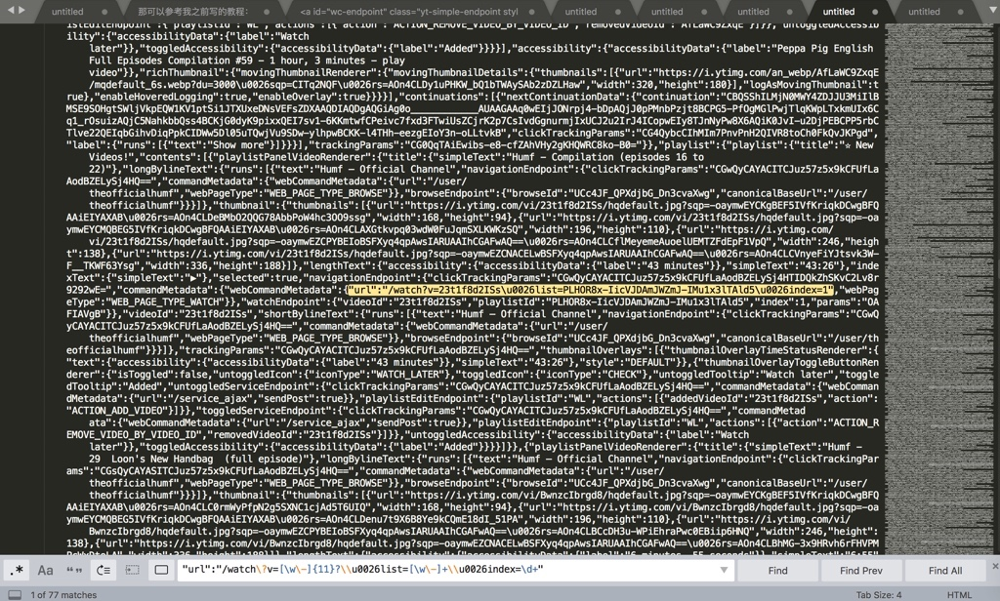

点击Find，继续向下找，比如找到第14个：`14/77`

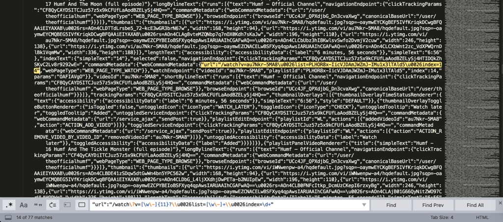

另外，进一步的举例：

此处，对应着页面上的其实只是希望找到66个地址就可以了：

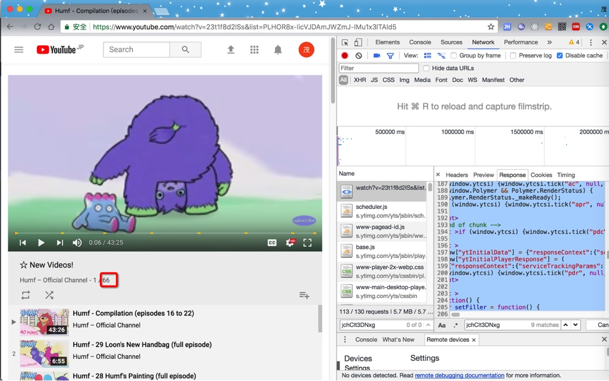

但是此处找到77个，多出11个，则是由于：

此处的js的变量的值中，包含了不需要的额外的11个

所以此时，由于没法方便的从字符串中区别开来，不好去掉另外那11个，则只能：

想办法拿到js的变量值，然后通过转换为json，然后再去获取json对象中的值，即可准确的得到所需要的值。

所以此处，又可以接着通过正则去先得到js的变量的值：

用正则：

```bash
window\["ytInitialData"\]\s*=\s*

;\s+window\["ytInitialPlayerResponse"\]
```

从：

```js
  <script >
    window["ytInitialData"] = {"responseContext”:
...
xqmOCnbELAge-VPNjlN1SqHurYg"}};
    window["ytInitialPlayerResponse"] = (
```

中，搜索到所要的内容：

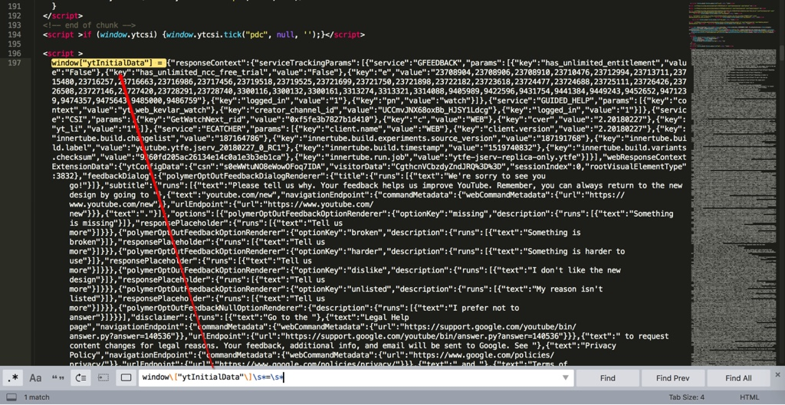

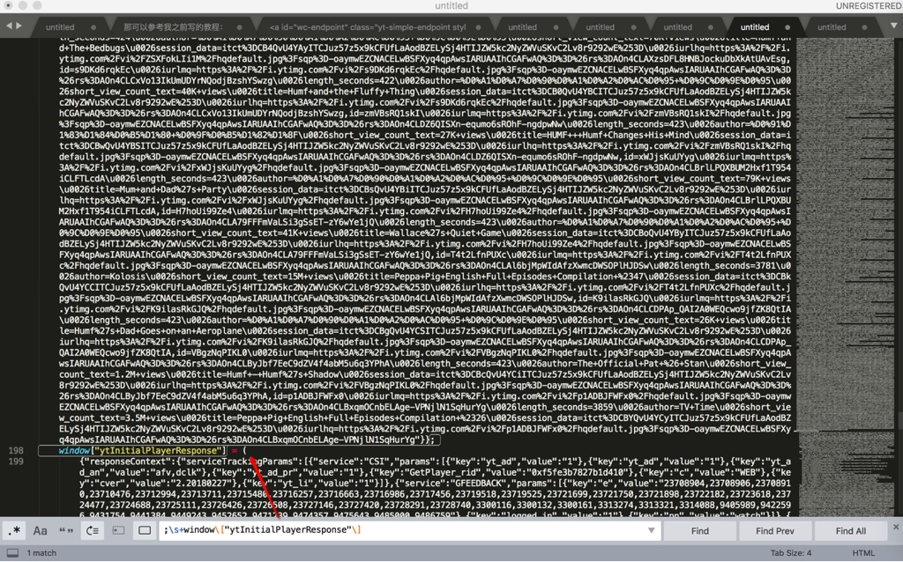

而首尾的正则之间的内容，就是需要找的js的变量的值，是个json

对应着写个完整的正则：

```bash
window\["ytInitialData"\]\s*=\s*(.+?);\s+window\["ytInitialPlayerResponse"\]
```

就可以匹配到这段完整的内容了：

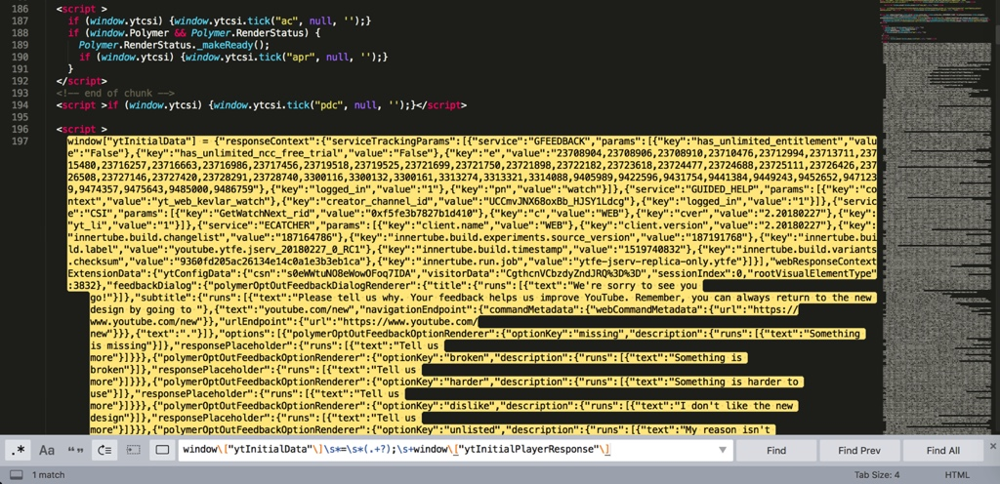

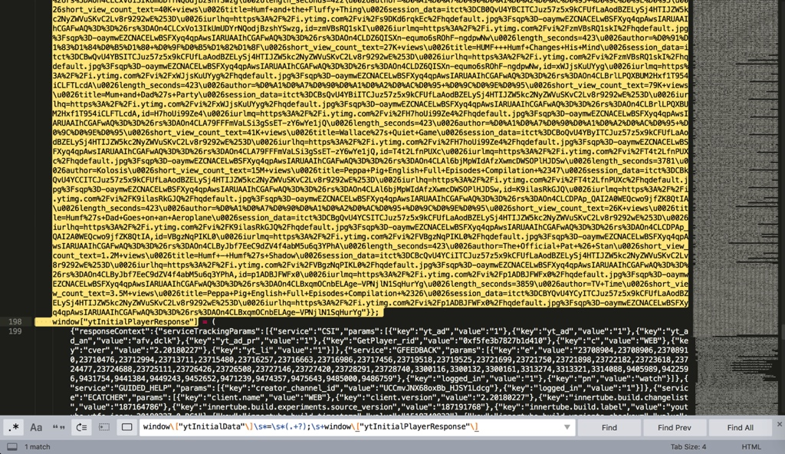

后续就可以通过解析json去精确获取所要的url的值了。

比如第12个url：

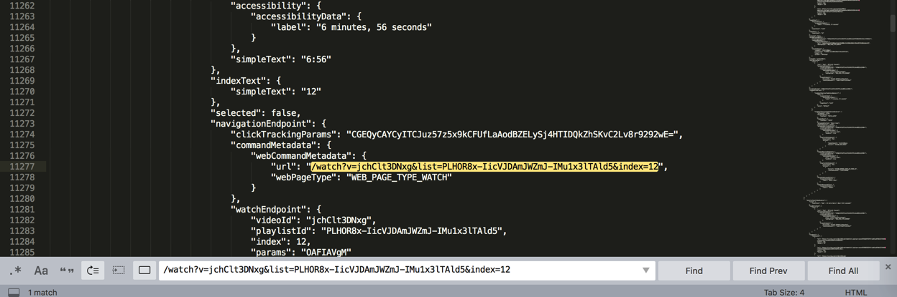

由此实现了：

根据自己的实际的（业务）需求，通过充分利用正则表达式，获取想要的符合特定某一规则的内容。

## html中提取出浙江省的每个市到Xmind中

```html
<div class="menu transition visible" tabindex="-1" style="display: block !important;"><div class="item selected" data-value="330100">杭州市</div><div class="item" data-value="330200">宁波市</div><div class="item" data-value="330300">温州市</div><div class="item" data-value="330400">嘉兴市</div><div class="item" data-value="330500">湖州市</div><div class="item" data-value="330600">绍兴市</div><div class="item" data-value="330700">金华市</div><div class="item" data-value="330800">衢州市</div><div class="item" data-value="330900">舟山市</div><div class="item" data-value="331000">台州市</div><div class="item" data-value="331100">丽水市</div></div>
```

希望提取出每个市

正则写法：

* 查找Find：`<div.*?data-value="\d+">(\S+?)</div>`
* 替换Replace：`$1\r\n`

点击`Replace All`：

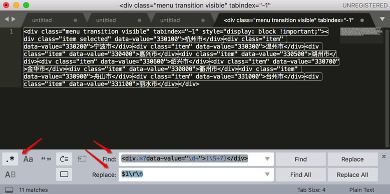

替换成：

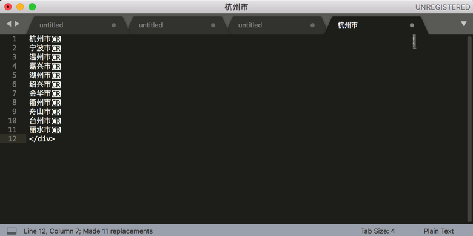

忽略掉最后的`</div>`，拷贝出来，即可得到我要的所有的市：

```bash
杭州市
宁波市
温州市
嘉兴市
湖州市
绍兴市
金华市
衢州市
舟山市
台州市
丽水市
```

->

如此继续重复此步骤，直到把网页中的内容：

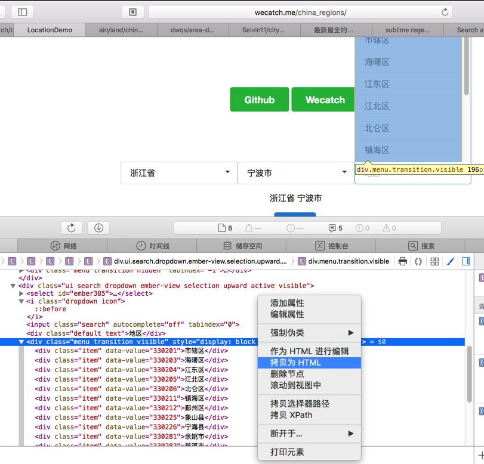

分多次，但是是批量的：


全部都整理到Xmind中：


就不用一个个拷贝，一个个粘贴了 -》 从而提高工作效率。
