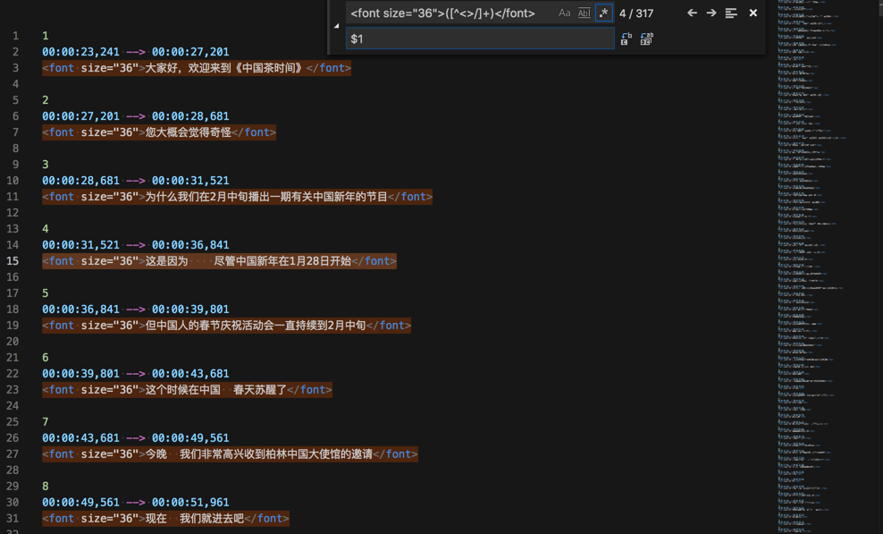
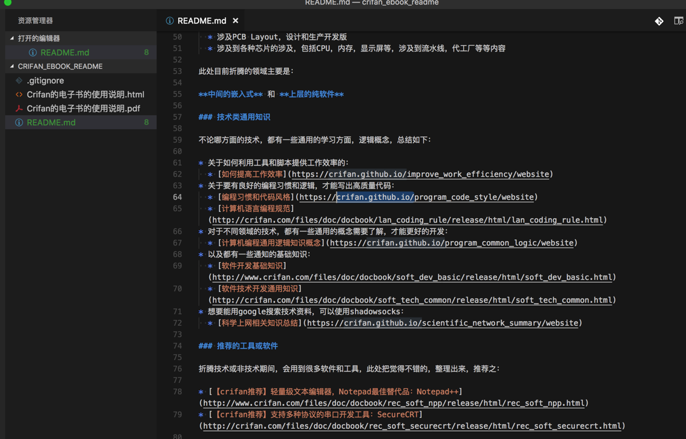
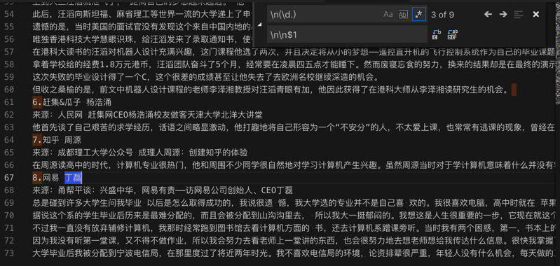
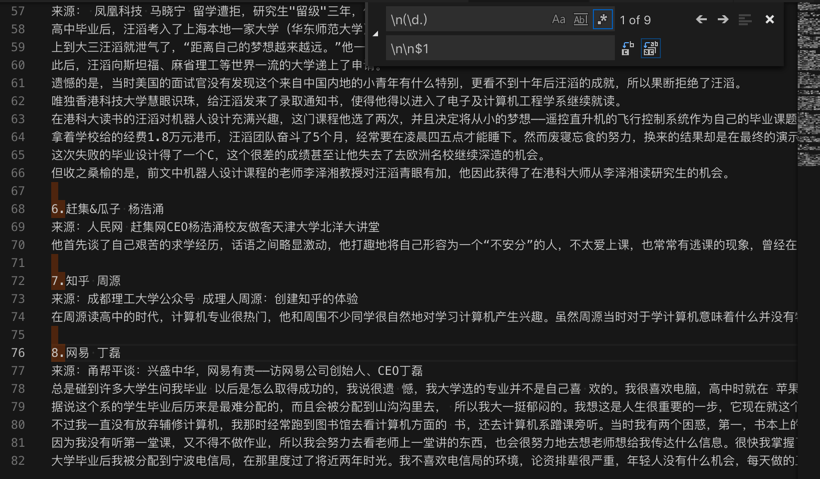
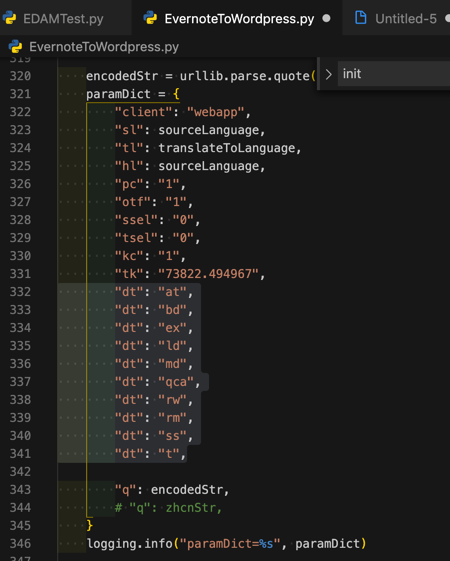
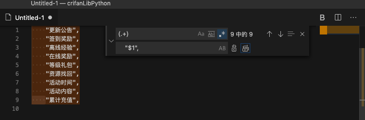
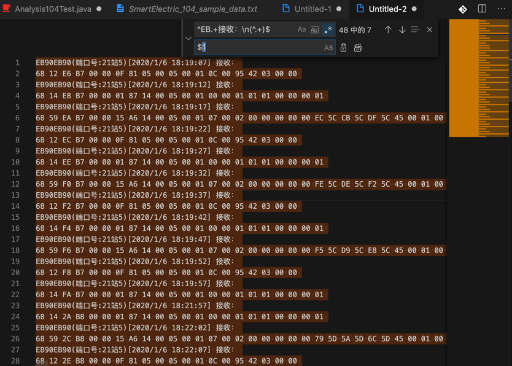
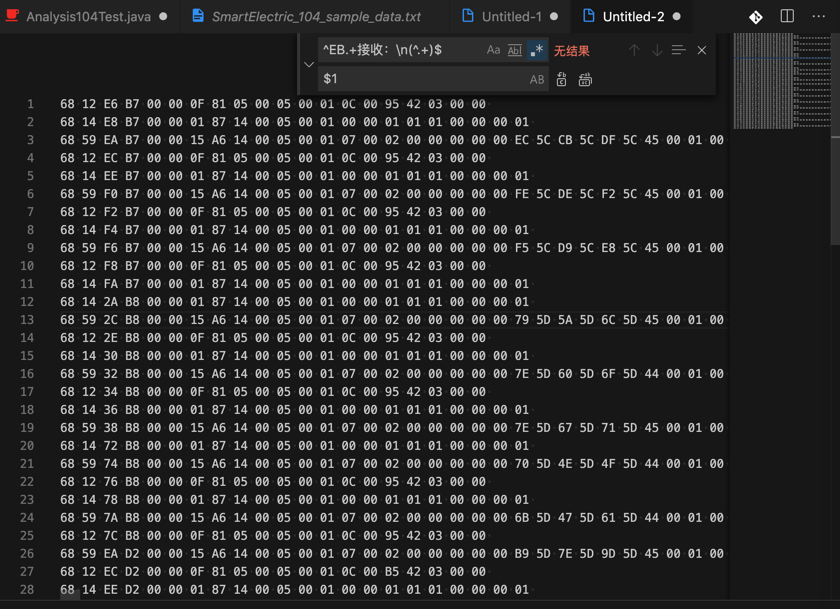
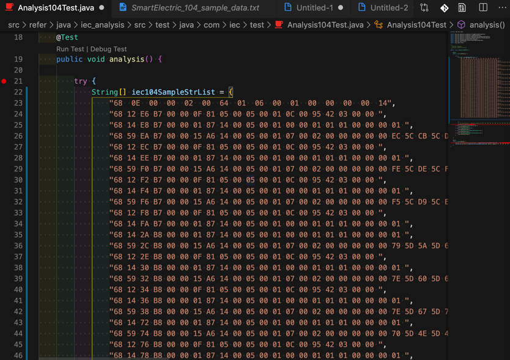
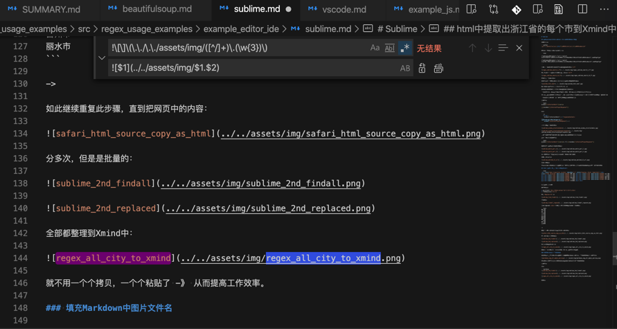

# VSCode

## 普通的搜索和替换

下面是一些相对普通的正则的搜索和替换的应用举例：

### 去除内容中多余的 lessionxxx的单词

正则：

```bash
lesson\s*\d+\n

```

从：


替换成：


### 语句末尾去掉感叹号

正则：

```bash
!\n
\n
```

从：


替换成：


## 高级的搜索和替换

下面是一些，相对高级一些的用法，比如：

* 搜索带`分组`
  * 即：`(xxx)`
* 替换时带`引用`
  * 即：`$N`
    * N=1,2,3,...

等正则应用举例，供参考。

### 文章标题和链接转换为Markdown的链接

正则替换规则：

```bash
(.+)\n(http.+)\n
* [$1]($2)\n
```

从：

```bash
android - decompiling DEX into Java sourcecode - Stack Overflow
https://stackoverflow.com/questions/1249973/decompiling-dex-into-java-sourcecode/55486175#55486175
decompiler - how to use DEXtoJar - Stack Overflow
https://stackoverflow.com/questions/5257830/how-to-use-dextojar/55486507#55486507
android - Is there a way to get the source code from an APK file? - Stack Overflow
https://stackoverflow.com/questions/3593420/is-there-a-way-to-get-the-source-code-from-an-apk-file/55567538#55567538
Android反编译简单实战 - 知乎
https://zhuanlan.zhihu.com/p/51260384
Android应用加固产品使用对比 - 『移动安全区』 - 吾爱破解 - LCG - LSG |安卓破解|病毒分析|破解软件|www.52pojie.cn
https://www.52pojie.cn/thread-832804-1-1.html
Android混淆（ProGuard）从0到1 - 简书
https://www.jianshu.com/p/1b76e4c10495
乐固加固脱壳实战 - faTe's Home
http://www.holdheart.com/archives/33.html
乐固壳分析 - bamb00 - 博客园
http://www.cnblogs.com/goodhacker/p/8666217.html
Android APK 反编译实践 - 简书
https://www.jianshu.com/p/9e0d1c3e342e
5分钟学会基于Xposed+DumpDex的apk快速脱壳方法 - 简书
https://www.jianshu.com/p/9d988bdddb3d
腾讯加固纯手工简易脱壳教程 - 『移动安全区』 - 吾爱破解 - LCG - LSG |安卓破解|病毒分析|破解软件|www.52pojie.cn
https://www.52pojie.cn/thread-428271-1-1.html
ANDROID 逆向实例（八）－ 乐固加固脱壳（2017.01） ~ and-rev
https://and-rev.blogspot.com/2017/05/android-201701.html
花生日记APP邀请注册机实战（360加固脱壳） – Silkage's Blog
https://blog.silkage.net/software/peanutdiary.html
如何反编译Android 的apk/dex/odex，获得源码 – 码农日记
https://www.androiddev.net/反编译android-的apk/
HangZhouCat/ReaverAPKTools: 逆向APK工具
https://github.com/HangZhouCat/ReaverAPKTools
Android逆向之路---脱壳360加固 - 简书
https://www.jianshu.com/p/d24c6694fe97
26款优秀的Android逆向工程工具 - 简书
https://www.jianshu.com/p/ef0b6f75c229
Application Hardening - Mobile App Hardening | Promon
https://promon.co/security-news/application-hardening/
Cydia Substrate使用手册 - 简书
https://www.jianshu.com/p/ba795ff3471a
```

把：


换成：

```markdown
* [android - decompiling DEX into Java sourcecode - Stack Overflow](https://stackoverflow.com/questions/1249973/decompiling-dex-into-java-sourcecode/55486175#55486175)
* [decompiler - how to use DEXtoJar - Stack Overflow](https://stackoverflow.com/questions/5257830/how-to-use-dextojar/55486507#55486507)
* [android - Is there a way to get the source code from an APK file? - Stack Overflow](https://stackoverflow.com/questions/3593420/is-there-a-way-to-get-the-source-code-from-an-apk-file/55567538#55567538)
* [Android反编译简单实战 - 知乎](https://zhuanlan.zhihu.com/p/51260384)
* [Android应用加固产品使用对比 - 『移动安全区』 - 吾爱破解 - LCG - LSG |安卓破解|病毒分析|破解软件|www.52pojie.cn](https://www.52pojie.cn/thread-832804-1-1.html)
* [Android混淆（ProGuard）从0到1 - 简书](https://www.jianshu.com/p/1b76e4c10495)
* [乐固加固脱壳实战 - faTe's Home](http://www.holdheart.com/archives/33.html)
* [乐固壳分析 - bamb00 - 博客园](http://www.cnblogs.com/goodhacker/p/8666217.html)
* [Android APK 反编译实践 - 简书](https://www.jianshu.com/p/9e0d1c3e342e)
* [5分钟学会基于Xposed+DumpDex的apk快速脱壳方法 - 简书](https://www.jianshu.com/p/9d988bdddb3d)
* [腾讯加固纯手工简易脱壳教程 - 『移动安全区』 - 吾爱破解 - LCG - LSG |安卓破解|病毒分析|破解软件|www.52pojie.cn](https://www.52pojie.cn/thread-428271-1-1.html)
* [ANDROID 逆向实例（八）－ 乐固加固脱壳（2017.01） ~ and-rev](https://and-rev.blogspot.com/2017/05/android-201701.html)
* [花生日记APP邀请注册机实战（360加固脱壳） – Silkage's Blog](https://blog.silkage.net/software/peanutdiary.html)
* [如何反编译Android 的apk/dex/odex，获得源码 – 码农日记](https://www.androiddev.net/反编译android-的apk/)
* [HangZhouCat/ReaverAPKTools: 逆向APK工具](https://github.com/HangZhouCat/ReaverAPKTools)
* [Android逆向之路---脱壳360加固 - 简书](https://www.jianshu.com/p/d24c6694fe97)
* [26款优秀的Android逆向工程工具 - 简书](https://www.jianshu.com/p/ef0b6f75c229)
* [Application Hardening - Mobile App Hardening | Promon](https://promon.co/security-news/application-hardening/)
* [Cydia Substrate使用手册 - 简书](https://www.jianshu.com/p/ba795ff3471a)
```


用于：放在`markdown`作为参考资料。

### json后缀的字符串变成代码中字符串列表

正则：

```bash
(\w+)\n
  "$1",\n
```

从：

```bash
booklistsJson
rbrsJson
latestCommentJson
myCommentJson
whoHasThisBookJson
topicArrayJson
bookFeaturesArrayJson
bookFeaturesWithContentArrayJson
worksCollectionArrayJson
readingAgeDistributionArrayJson
topReadingAgeDistributionArrayJson
scoreDistributionArrayJson
likeThisBookKidsAlsoLikeBookArrayJson
childDataArrayJson
inPagePictureArrayJson
xunxiArrayJson
experienceArrayJson
answerArrayJson
englishLevelArrayJson

```


变成：

```bash
  "booklistsJson",
  "rbrsJson",
  "latestCommentJson",
  "myCommentJson",
  "whoHasThisBookJson",
  "topicArrayJson",
  "bookFeaturesArrayJson",
  "bookFeaturesWithContentArrayJson",
  "worksCollectionArrayJson",
  "readingAgeDistributionArrayJson",
  "topReadingAgeDistributionArrayJson",
  "scoreDistributionArrayJson",
  "likeThisBookKidsAlsoLikeBookArrayJson",
  "childDataArrayJson",
  "inPagePictureArrayJson",
  "xunxiArrayJson",
  "experienceArrayJson",
  "answerArrayJson",
  "englishLevelArrayJson",
```


用于：

拷贝到代码里，用于列表变量的值：


省去：自己手动去对每一行手动去加上`""`再控制`缩进`的繁琐工作了。

### 获取到康美通的版本历史

正则：

```bash
(\.\d+)\n
$1 
```

从：

```bash
相关历史版本


23.34MB最新版
康美通 4.3.0
23.34MB 安全下载
康美通 4.2.3
19.47MB 安全下载
康美通 4.2.2
19.29MB 安全下载
康美通 4.2.1
19.29MB 安全下载
康美通 4.2.0
19.18MB 安全下载
康美通 4.1.1
19.47MB 安全下载
康美通 4.1.0
19.48MB 安全下载
康美通 4.0
14.37MB 安全下载
康美通 3.2
14.22MB 安全下载
康美通 3.1
23.2MB 安全下载
康美通 3.0
23.1MB 安全下载
康美通 2.0.9
7.93MB 安全下载
康美通 2.0.8
7.3MB 安全下载
康美通 2.0.7
7.29MB 安全下载
康美通 2.0.6
7.29MB 安全下载
康美通 1.0.1
6.27MB 安全下载
康美通 1.0beta
5.86MB 安全下载
 下载豌豆荚客户端 (更多历史版本)下载
康美通 历史版本年份合集
```


替换成：

```bash
相关历史版本

23.34MB最新版
康美通 4.3.0 23.34MB 安全下载
康美通 4.2.3 19.47MB 安全下载
康美通 4.2.2 19.29MB 安全下载
康美通 4.2.1 19.29MB 安全下载
康美通 4.2.0 19.18MB 安全下载
康美通 4.1.1 19.47MB 安全下载
康美通 4.1.0 19.48MB 安全下载
康美通 4.0 14.37MB 安全下载
康美通 3.2 14.22MB 安全下载
康美通 3.1 23.2MB 安全下载
康美通 3.0 23.1MB 安全下载
康美通 2.0.9 7.93MB 安全下载
康美通 2.0.8 7.3MB 安全下载
康美通 2.0.7 7.29MB 安全下载
康美通 2.0.6 7.29MB 安全下载
康美通 1.0.1 6.27MB 安全下载
康美通 1.0beta
5.86MB 安全下载
 下载豌豆荚客户端 (更多历史版本)下载
康美通 历史版本年份合集
```


再去用正则：

```bash
 安全下载

```

替换，得到我们要的：

```bash
相关历史版本：
康美通 4.3.1 23.34MB
康美通 4.3.0 23.34MB
康美通 4.2.3 19.47MB
康美通 4.2.2 19.29MB
康美通 4.2.1 19.29MB
康美通 4.2.0 19.18MB
康美通 4.1.1 19.47MB
康美通 4.1.0 19.48MB
康美通 4.0 14.37MB
康美通 3.2 14.22MB
康美通 3.1 23.2MB
康美通 3.0 23.1MB
康美通 2.0.9 7.93MB
康美通 2.0.8 7.3MB
康美通 2.0.7 7.29MB
康美通 2.0.6 7.29MB
康美通 1.0.1 6.27MB
康美通 1.0beta 5.86MB
```

### 去掉srt字幕中font size

正则：

```bash
<font size="36">([^<>/]+)</font>
$1
```

从：



替换成：


### crifan电子书中链接替换

对于我的电子书的说明：

https://github.com/crifan/crifan_ebook_readme

的markdown源码：



想要把其中的地址：

`https://crifan.github.io/xxx/website`

替换为：

`https://book.crifan.com/books/xxx/website/`

比如：

`https://crifan.github.io/program_code_style/website`

替换成：

`https://book.crifan.com/books/program_code_style/website/`

用正则：

```bash
https?://crifan.github.io/(\w+)/website/?
https://book.crifan.com/books/$1/website/
```

实现从：


替换成：


## 将Chrome中拷贝出来的cookie处理成代码中要的dict

Chrome中拷贝出来的cookie是：

```bash
welcomeflash=20050606_107001; zzpaneluin=; zzpanelkey=; pgv_pvi=7640393728; pgv_si=s3147298816; pgv_pvid=3951804270; pgv_info=ssid=s7487670374; ptisp=ctc; ptui_loginuin=2539619267; pt2gguin=o2539619267; uin=o2539619267; skey=@nDTkOJm1m; RK=Ye5Jmtb0ly; ptcz=3b6806bf7cddc375bc2d23b04ff9c366b47fac808b9256322ad69a23f2dc580f; p_uin=o2539619267; pt4_token=aC5vGfNAA2M3fS7ngcAHdXoiCvqwrAGcEuL54gs63oE_; p_skey=kSC7q75Gk93gLlo*mRMg*h2m3iYUuubjQqVBIgEMi*o_; Loading=Yes
```

最后加上分号：

```bash
welcomeflash=20050606_107001; zzpaneluin=; zzpanelkey=; pgv_pvi=7640393728; pgv_si=s3147298816; pgv_pvid=3951804270; pgv_info=ssid=s7487670374; ptisp=ctc; ptui_loginuin=2539619267; pt2gguin=o2539619267; uin=o2539619267; skey=@nDTkOJm1m; RK=Ye5Jmtb0ly; ptcz=3b6806bf7cddc375bc2d23b04ff9c366b47fac808b9256322ad69a23f2dc580f; p_uin=o2539619267; pt4_token=aC5vGfNAA2M3fS7ngcAHdXoiCvqwrAGcEuL54gs63oE_; p_skey=kSC7q75Gk93gLlo*mRMg*h2m3iYUuubjQqVBIgEMi*o_; Loading=Yes;
```

再去用正则：

```bash
(\w+)=([^,^=]*); ?
"$1": "$2",\n
```

替换：


成自己要的dict的内容：


中间有个特殊的，自己手动改一下即可：

```bash
"welcomeflash": "20050606_107001",
"zzpaneluin": "",
"zzpanelkey": "",
"pgv_pvi": "7640393728",
"pgv_si": "s3147298816",
"pgv_pvid": "3951804270",
"pgv_info": "ssid=s7487670374",
"ptisp": "ctc",
"ptui_loginuin": "2539619267",
"pt2gguin": "o2539619267",
"uin": "o2539619267",
"skey": "@nDTkOJm1m",
"RK": "Ye5Jmtb0ly",
"ptcz": "3b6806bf7cddc375bc2d23b04ff9c366b47fac808b9256322ad69a23f2dc580f",
"p_uin": "o2539619267",
"pt4_token": "aC5vGfNAA2M3fS7ngcAHdXoiCvqwrAGcEuL54gs63oE_",
"p_skey": "kSC7q75Gk93gLlo*mRMg*h2m3iYUuubjQqVBIgEMi*o_",
"Loading": "Yes;",
```

粘贴到代码中即可使用了：


## 处理得到城市名称

除了：

[【整理】中国常见的城市的名字](https://www.crifan.com/china_common_city_name/)

以及：

对于：

https://en.wikipedia.org/wiki/List_of_urban_areas_by_population

中的城市名，用正则：

```bash
\[\d+\]

```

去除掉`[数字]`

从：


替换成：


以及继续用：

```bash
\(([\w\s]+)\)$
$1
```

把`(xxx)`中的`xxx`放到下一行

从：


替换成：


当然，也注意到了，没有匹配到：

`Nagoya (Chūkyō)`

是因为里面有unicode的字符，由于数量不多，手动处理即可。

再去用：

```bash
–([\w\s]+)
\n$1
```

把`xxx-yyy`中的`yyy`放到下一行


替换成：


以及，用：

```bash
\s*\(.+\)$

```

把`xxx (yyy)`中的`空格(yyy)`去掉：


替换成：


再继续，用：

```bash
^\s
\n
```

可以找到：

有哪些单词在行首有多余的空格（后续可以再去删除掉）：

![vscode_remove_start_empty.png)

## 提取mp3文件名和mp3链接地址

正则：

```bash
^[^\r\n]+href="(\w+\](../../assets/img/vscode_remove_start_empty.png)

## 提取mp3文件名和mp3链接地址

正则：

```bash
^[^\r\n]+href="(\w+\.mp3)"[^\r\n]+$
$1
```

把：

```html
 <a href="e10d3a.mp3">e10d3a.mp3</a> 2015-09-23 09:10 9.3M
 <a href="e10d3b.mp3">e10d3b.mp3</a> 2015-09-23 09:10 7.0M
 <a href="e10d5a.mp3">e10d5a.mp3</a> 2015-09-23 09:11 54M
```

替换为：

```bash
e10d3a.mp3
e10d3b.mp3
e10d5a.mp3
```

再进一步：

用正则：

```bash
^[^\r\n]+href="(\w+\.mp3)"[^\r\n]+$
http://media.talkbank.org/CHILDES/Biling/Singapore/$1
```

从：

```html
 <a href="e10d3a.mp3">e10d3a.mp3</a> 2015-09-23 09:10 9.3M
 <a href="e10d3b.mp3">e10d3b.mp3</a> 2015-09-23 09:10 7.0M
 <a href="e10d5a.mp3">e10d5a.mp3</a> 2015-09-23 09:11 54M
```

替换和提取出：

```bash
http://media.talkbank.org/CHILDES/Biling/Singapore/e10d3a.mp3
http://media.talkbank.org/CHILDES/Biling/Singapore/e10d3b.mp3
http://media.talkbank.org/CHILDES/Biling/Singapore/e10d5a.mp3
```

详见：

[【已解决】VSCode中如何使用正则表达式去替换且被替换中使用分组group](http://www.crifan.com/vscode_use_regex_replace_using_group)

### 去除掉csv中多余的`="xxx"`

客户给的一个数据文件csv格式的，但是内部内容中发现有多余的 `="xxx"`，应该改为`xxx`才对。

所以用VSCode去替换，用正则：

```bash
="(.+?)”
$1
```

实现了，把 `="7xxx1"`：


替换成 `7xxx1`：


即可。

### 给文章段落增加换行

用正则：

```bash
\n(\d.)
\n\n$1
```

把：

```bash
...互。
1.字节跳动
...说过。
2.陆奇给年轻人的话
...
8.网易 丁磊
...
```



变成：

```bash
...互。
1.字节跳动
...说过。

2.陆奇给年轻人的话
...

8.网易 丁磊
...
```



### 把url中查询参数换成代码中字典参数

用正则：

```bash
dt=([^&]+)&?
"dt": "$1",\n
```

把：

```bash
dt=at&dt=bd&dt=ex&dt=ld&dt=md&dt=qca&dt=rw&dt=rm&dt=ss&dt=t
```


替换成：

```bash
"dt": "at",
"dt": "bd",
"dt": "ex",
"dt": "ld",
"dt": "md",
"dt": "qca",
"dt": "rw",
"dt": "rm",
"dt": "ss",
"dt": "t",
```


用于后续放到代码中使用：



### 把每个词都加上引号，用于放代码中用

用正则：

```bash
(.+)
    "$1",
```

从输入：

```bash
更新公告
签到奖励
离线经验
在线奖励
等级礼包
资源找回
活动时间
活动内容
累计充值

```


变成：

```bash
    "更新公告",
    "签到奖励",
    "离线经验",
    "在线奖励",
    "等级礼包",
    "资源找回",
    "活动时间",
    "活动内容",
    "累计充值",
```



用于拷贝到代码中使用：


### 提取104协议示例数据，并格式化成java代码中字符串数组

从：

```bash
EB90EB90(端口号:21站0)[2020/1/6 18:18:58] 发送：
68 04 07 00 00 00 
EB90EB90(端口号:21站5)[2020/1/6 18:19:07] 接收：
68 12 E6 B7 00 00 0F 81 05 00 05 00 01 0C 00 95 42 03 00 00 
EB90EB90(端口号:21站5)[2020/1/6 18:19:07] 发送：
68 04 01 00 E6 B7 
EB90EB90(端口号:21站5)[2020/1/6 18:19:12] 接收：
68 14 E8 B7 00 00 01 87 14 00 05 00 01 00 00 01 01 01 00 00 00 01 
EB90EB90(端口号:21站5)[2020/1/6 18:19:12] 发送：
68 04 01 00 E8 B7 
EB90EB90(端口号:21站5)[2020/1/6 18:19:17] 接收：
68 59 EA B7 00 00 15 A6 14 00 05 00 01 07 00 02 00 00 00 00 00 EC 5C CB 5C DF 5C 45 00 01 00 FE FF 7C 00 94 02 00 00 00 00 00 00 00 00 00 00 00 00 00 00 00 00 00 00 00 00 00 00 00 00 00 00 86 13 00 00 02 00 00 00 00 00 FE FF 00 00 00 00 87 00 00 00 00 00 02 00 00 00 00 00 
...
EB90EB90(端口号:21站5)[2020/1/6 23:08:55] 发送：
68 04 01 00 12 D3 
EB90EB90(端口号:21站5)[2020/1/6 23:09:00] 接收：
68 59 14 D3 00 00 15 A6 14 00 05 00 01 07 00 02 00 00 00 00 00 BC 5D 88 5D A7 5D 44 00 01 00 FE FF 7C 00 84 02 00 00 00 00 00 00 00 00 00 00 00 00 00 00 00 00 00 00 00 00 00 00 00 00 00 00 88 13 00 00 02 00 00 00 00 00 FE FF 00 00 00 00 B6 00 00 00 00 00 02 00 00 00 00 00 
EB90EB90(端口号:21站5)[2020/1/6 23:09:06] 接收：
68 12 16 D3 00 00 0F 81 05 00 05 00 01 0C 00 B6 42 03 00 00 
EB90EB90(端口号:21站5)[2020/1/6 23:09:06] 发送：
68 04 01 00 16 D3 
```

提取出：接收：的下一行的一连串数字

（1）先 去除 发送的部分

正则：

```bash
^EB.+发送：\n(^.+)$\n

```


替换成：


（2）再去把接收部分中数字提取出来

从：

```bash
EB90EB90(端口号:21站5)[2020/1/6 18:19:07] 接收：
68 12 E6 B7 00 00 0F 81 05 00 05 00 01 0C 00 95 42 03 00 00 
EB90EB90(端口号:21站5)[2020/1/6 18:19:12] 接收：
68 14 E8 B7 00 00 01 87 14 00 05 00 01 00 00 01 01 01 00 00 00 01 
...
EB90EB90(端口号:21站5)[2020/1/6 23:08:55] 接收：
68 14 12 D3 00 00 01 87 14 00 05 00 01 00 00 01 01 01 00 00 00 01 
EB90EB90(端口号:21站5)[2020/1/6 23:09:00] 接收：
68 59 14 D3 00 00 15 A6 14 00 05 00 01 07 00 02 00 00 00 00 00 BC 5D 88 5D A7 5D 44 00 01 00 FE FF 7C 00 84 02 00 00 00 00 00 00 00 00 00 00 00 00 00 00 00 00 00 00 00 00 00 00 00 00 00 00 88 13 00 00 02 00 00 00 00 00 FE FF 00 00 00 00 B6 00 00 00 00 00 02 00 00 00 00 00 
EB90EB90(端口号:21站5)[2020/1/6 23:09:06] 接收：
68 12 16 D3 00 00 0F 81 05 00 05 00 01 0C 00 B6 42 03 00 00 

```

用正则：

```bash
^EB.+接收：\n(^.+)$
$1
```

把：



替换成：



得到每一行的数字：

```bash
68 12 E6 B7 00 00 0F 81 05 00 05 00 01 0C 00 95 42 03 00 00 
68 14 E8 B7 00 00 01 87 14 00 05 00 01 00 00 01 01 01 00 00 00 01 
68 59 EA B7 00 00 15 A6 14 00 05 00 01 07 00 02 00 00 00 00 00 EC 5C CB 5C DF 5C 45 00 01 00 FE FF 7C 00 94 02 00 00 00 00 00 00 00 00 00 00 00 00 00 00 00 00 00 00 00 00 00 00 00 00 00 00 86 13 00 00 02 00 00 00 00 00 FE FF 00 00 00 00 87 00 00 00 00 00 02 00 00 00 00 00 
...
68 12 16 D3 00 00 0F 81 05 00 05 00 01 0C 00 B6 42 03 00 00 
```

（3）再去变成java字符串数组，即给每一行加上前后双引号

用正则：

```bash
^(.+)$
                "$1",
```

把：


变成：


```bash
                "68 12 E6 B7 00 00 0F 81 05 00 05 00 01 0C 00 95 42 03 00 00 ",
                "68 14 E8 B7 00 00 01 87 14 00 05 00 01 00 00 01 01 01 00 00 00 01 ",
                "68 59 EA B7 00 00 15 A6 14 00 05 00 01 07 00 02 00 00 00 00 00 EC 5C CB 5C DF 5C 45 00 01 00 FE FF 7C 00 94 02 00 00 00 00 00 00 00 00 00 00 00 00 00 00 00 00 00 00 00 00 00 00 00 00 00 00 86 13 00 00 02 00 00 00 00 00 FE FF 00 00 00 00 87 00 00 00 00 00 02 00 00 00 00 00 ",
                "68 12 EC B7 00 00 0F 81 05 00 05 00 01 0C 00 95 42 03 00 00 ",
...
                "68 12 16 D3 00 00 0F 81 05 00 05 00 01 0C 00 B6 42 03 00 00 ",
```

用于粘贴到代码中使用：



->从而把：

* 繁琐的，手工的，从原始文件中拷贝和粘贴的重复劳动，
* 快捷的，自动的，完成，且更准确，不会出现手动操作的失误。

### 填充Markdown中图片文件名

此处正在写教程期间，正好有个需求：为了避免和消除Markdown中的，关于图片的文件名即image的alt的text是空的警告：


然后正好用正则，去自动填充此处image的alt的text，即图片的文件名

用正则：

```bash
!\[\]\(\.\./\.\./assets/img/([^/]+)\.(\w{3})\)

```

把：

```bash


```


变成：

```bash


```



即可自动填充image的alt的text，消除Markdown中的警告了。
