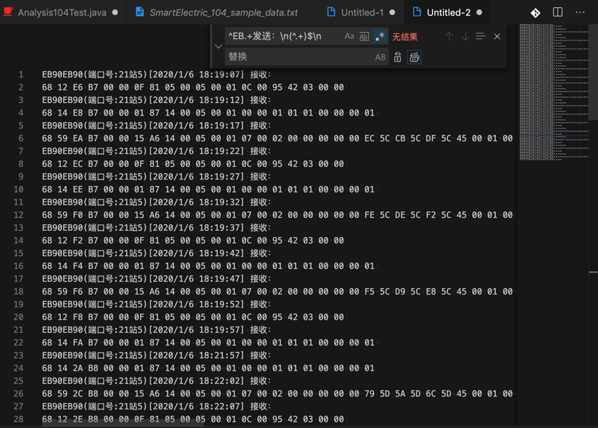
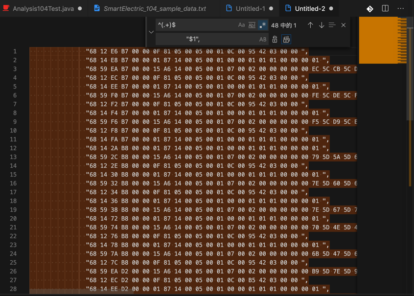

# 提取104协议示例数据，并格式化成java代码中字符串数组

从：

```bash
EB90EB90(端口号:21站0)[2020/1/6 18:18:58] 发送：
68 04 07 00 00 00 
EB90EB90(端口号:21站5)[2020/1/6 18:19:07] 接收：
68 12 E6 B7 00 00 0F 81 05 00 05 00 01 0C 00 95 42 03 00 00 
EB90EB90(端口号:21站5)[2020/1/6 18:19:07] 发送：
68 04 01 00 E6 B7 
EB90EB90(端口号:21站5)[2020/1/6 18:19:12] 接收：
68 14 E8 B7 00 00 01 87 14 00 05 00 01 00 00 01 01 01 00 00 00 01 
EB90EB90(端口号:21站5)[2020/1/6 18:19:12] 发送：
68 04 01 00 E8 B7 
EB90EB90(端口号:21站5)[2020/1/6 18:19:17] 接收：
68 59 EA B7 00 00 15 A6 14 00 05 00 01 07 00 02 00 00 00 00 00 EC 5C CB 5C DF 5C 45 00 01 00 FE FF 7C 00 94 02 00 00 00 00 00 00 00 00 00 00 00 00 00 00 00 00 00 00 00 00 00 00 00 00 00 00 86 13 00 00 02 00 00 00 00 00 FE FF 00 00 00 00 87 00 00 00 00 00 02 00 00 00 00 00 
...
EB90EB90(端口号:21站5)[2020/1/6 23:08:55] 发送：
68 04 01 00 12 D3 
EB90EB90(端口号:21站5)[2020/1/6 23:09:00] 接收：
68 59 14 D3 00 00 15 A6 14 00 05 00 01 07 00 02 00 00 00 00 00 BC 5D 88 5D A7 5D 44 00 01 00 FE FF 7C 00 84 02 00 00 00 00 00 00 00 00 00 00 00 00 00 00 00 00 00 00 00 00 00 00 00 00 00 00 88 13 00 00 02 00 00 00 00 00 FE FF 00 00 00 00 B6 00 00 00 00 00 02 00 00 00 00 00 
EB90EB90(端口号:21站5)[2020/1/6 23:09:06] 接收：
68 12 16 D3 00 00 0F 81 05 00 05 00 01 0C 00 B6 42 03 00 00 
EB90EB90(端口号:21站5)[2020/1/6 23:09:06] 发送：
68 04 01 00 16 D3 
```

提取出：接收：的下一行的一连串数字

（1）先 去除 发送的部分

正则：

```bash
^EB.+发送：\n(^.+)$\n

```


替换成：



（2）再去把接收部分中数字提取出来

从：

```bash
EB90EB90(端口号:21站5)[2020/1/6 18:19:07] 接收：
68 12 E6 B7 00 00 0F 81 05 00 05 00 01 0C 00 95 42 03 00 00 
EB90EB90(端口号:21站5)[2020/1/6 18:19:12] 接收：
68 14 E8 B7 00 00 01 87 14 00 05 00 01 00 00 01 01 01 00 00 00 01 
...
EB90EB90(端口号:21站5)[2020/1/6 23:08:55] 接收：
68 14 12 D3 00 00 01 87 14 00 05 00 01 00 00 01 01 01 00 00 00 01 
EB90EB90(端口号:21站5)[2020/1/6 23:09:00] 接收：
68 59 14 D3 00 00 15 A6 14 00 05 00 01 07 00 02 00 00 00 00 00 BC 5D 88 5D A7 5D 44 00 01 00 FE FF 7C 00 84 02 00 00 00 00 00 00 00 00 00 00 00 00 00 00 00 00 00 00 00 00 00 00 00 00 00 00 88 13 00 00 02 00 00 00 00 00 FE FF 00 00 00 00 B6 00 00 00 00 00 02 00 00 00 00 00 
EB90EB90(端口号:21站5)[2020/1/6 23:09:06] 接收：
68 12 16 D3 00 00 0F 81 05 00 05 00 01 0C 00 B6 42 03 00 00 

```

用正则：

```bash
^EB.+接收：\n(^.+)$
$1
```

把：


替换成：


得到每一行的数字：

```bash
68 12 E6 B7 00 00 0F 81 05 00 05 00 01 0C 00 95 42 03 00 00 
68 14 E8 B7 00 00 01 87 14 00 05 00 01 00 00 01 01 01 00 00 00 01 
68 59 EA B7 00 00 15 A6 14 00 05 00 01 07 00 02 00 00 00 00 00 EC 5C CB 5C DF 5C 45 00 01 00 FE FF 7C 00 94 02 00 00 00 00 00 00 00 00 00 00 00 00 00 00 00 00 00 00 00 00 00 00 00 00 00 00 86 13 00 00 02 00 00 00 00 00 FE FF 00 00 00 00 87 00 00 00 00 00 02 00 00 00 00 00 
...
68 12 16 D3 00 00 0F 81 05 00 05 00 01 0C 00 B6 42 03 00 00 
```

（3）再去变成java字符串数组，即给每一行加上前后双引号

用正则：

```bash
^(.+)$
                "$1",
```

把：


变成：



```bash
                "68 12 E6 B7 00 00 0F 81 05 00 05 00 01 0C 00 95 42 03 00 00 ",
                "68 14 E8 B7 00 00 01 87 14 00 05 00 01 00 00 01 01 01 00 00 00 01 ",
                "68 59 EA B7 00 00 15 A6 14 00 05 00 01 07 00 02 00 00 00 00 00 EC 5C CB 5C DF 5C 45 00 01 00 FE FF 7C 00 94 02 00 00 00 00 00 00 00 00 00 00 00 00 00 00 00 00 00 00 00 00 00 00 00 00 00 00 86 13 00 00 02 00 00 00 00 00 FE FF 00 00 00 00 87 00 00 00 00 00 02 00 00 00 00 00 ",
                "68 12 EC B7 00 00 0F 81 05 00 05 00 01 0C 00 95 42 03 00 00 ",
...
                "68 12 16 D3 00 00 0F 81 05 00 05 00 01 0C 00 B6 42 03 00 00 ",
```

用于粘贴到代码中使用：


->从而把：

* 繁琐的，手工的，从原始文件中拷贝和粘贴的重复劳动，
* 快捷的，自动的，完成，且更准确，不会出现手动操作的失误。
