# 一些大的例子

此处整理相对来说算是大的完整的一些的应用案例，供参考。

## crifan电子书中链接替换

对于我的电子书的说明：

https://github.com/crifan/crifan_ebook_readme

的markdown源码：

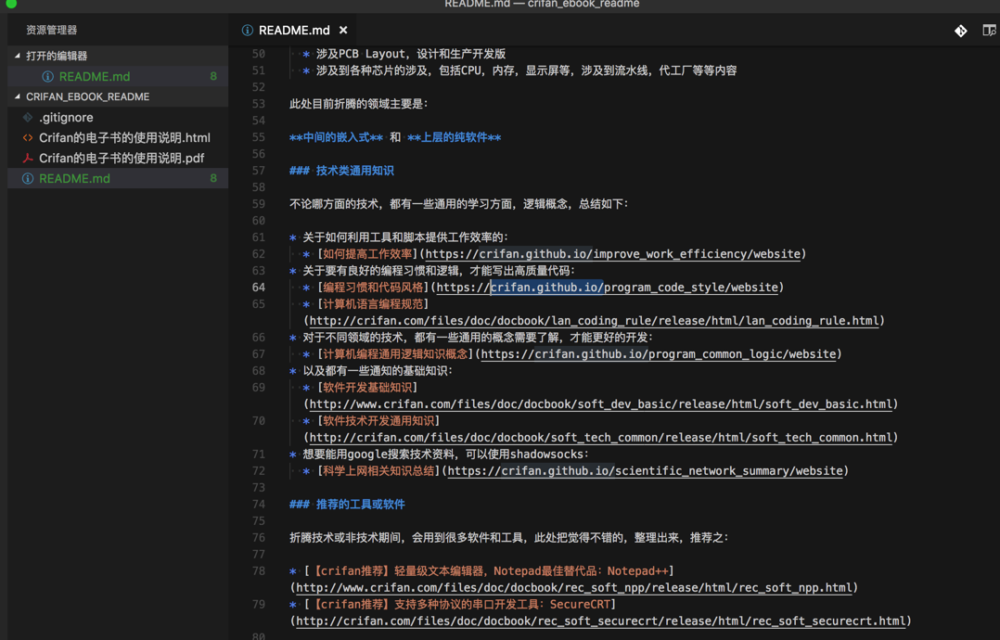

想要把其中的地址：

`https://crifan.github.io/xxx/website`

替换为：

`https://book.crifan.com/books/xxx/website/`

比如：

`https://crifan.github.io/program_code_style/website`

替换成：

`https://book.crifan.com/books/program_code_style/website/`

用正则：

```bash
https?://crifan.github.io/(\w+)/website/?
https://book.crifan.com/books/$1/website/
```

实现从：

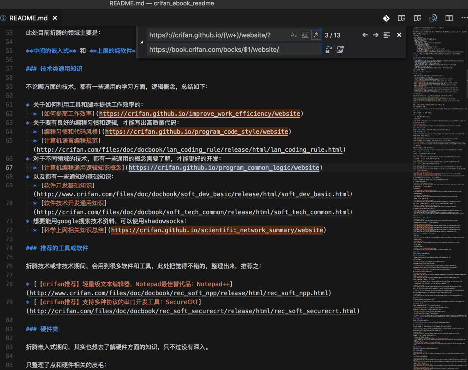

替换成：

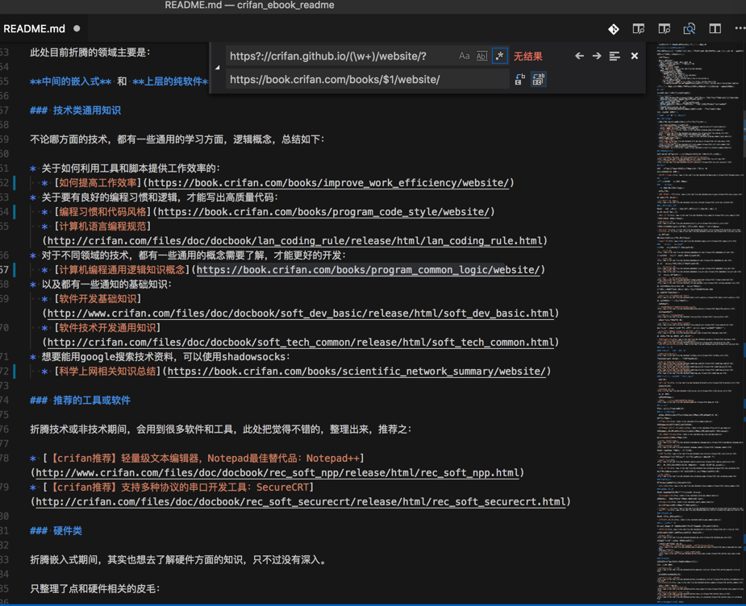

## 将Chrome中拷贝出来的cookie处理成代码中要的dict

Chrome中拷贝出来的cookie是：

```bash
welcomeflash=20050606_107001; zzpaneluin=; zzpanelkey=; pgv_pvi=7640393728; pgv_si=s3147298816; pgv_pvid=3951804270; pgv_info=ssid=s7487670374; ptisp=ctc; ptui_loginuin=2539619267; pt2gguin=o2539619267; uin=o2539619267; skey=@nDTkOJm1m; RK=Ye5Jmtb0ly; ptcz=3b6806bf7cddc375bc2d23b04ff9c366b47fac808b9256322ad69a23f2dc580f; p_uin=o2539619267; pt4_token=aC5vGfNAA2M3fS7ngcAHdXoiCvqwrAGcEuL54gs63oE_; p_skey=kSC7q75Gk93gLlo*mRMg*h2m3iYUuubjQqVBIgEMi*o_; Loading=Yes
```

最后加上分号：

```bash
welcomeflash=20050606_107001; zzpaneluin=; zzpanelkey=; pgv_pvi=7640393728; pgv_si=s3147298816; pgv_pvid=3951804270; pgv_info=ssid=s7487670374; ptisp=ctc; ptui_loginuin=2539619267; pt2gguin=o2539619267; uin=o2539619267; skey=@nDTkOJm1m; RK=Ye5Jmtb0ly; ptcz=3b6806bf7cddc375bc2d23b04ff9c366b47fac808b9256322ad69a23f2dc580f; p_uin=o2539619267; pt4_token=aC5vGfNAA2M3fS7ngcAHdXoiCvqwrAGcEuL54gs63oE_; p_skey=kSC7q75Gk93gLlo*mRMg*h2m3iYUuubjQqVBIgEMi*o_; Loading=Yes;
```

再去用正则：

```bash
(\w+)=([^,^=]*); ?
"$1": "$2",\n
```

替换：

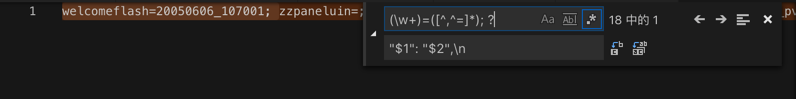

成自己要的dict的内容：

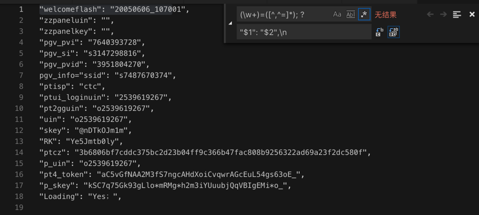

中间有个特殊的，自己手动改一下即可：

```bash
"welcomeflash": "20050606_107001",
"zzpaneluin": "",
"zzpanelkey": "",
"pgv_pvi": "7640393728",
"pgv_si": "s3147298816",
"pgv_pvid": "3951804270",
"pgv_info": "ssid=s7487670374",
"ptisp": "ctc",
"ptui_loginuin": "2539619267",
"pt2gguin": "o2539619267",
"uin": "o2539619267",
"skey": "@nDTkOJm1m",
"RK": "Ye5Jmtb0ly",
"ptcz": "3b6806bf7cddc375bc2d23b04ff9c366b47fac808b9256322ad69a23f2dc580f",
"p_uin": "o2539619267",
"pt4_token": "aC5vGfNAA2M3fS7ngcAHdXoiCvqwrAGcEuL54gs63oE_",
"p_skey": "kSC7q75Gk93gLlo*mRMg*h2m3iYUuubjQqVBIgEMi*o_",
"Loading": "Yes;",
```

粘贴到代码中即可使用了：

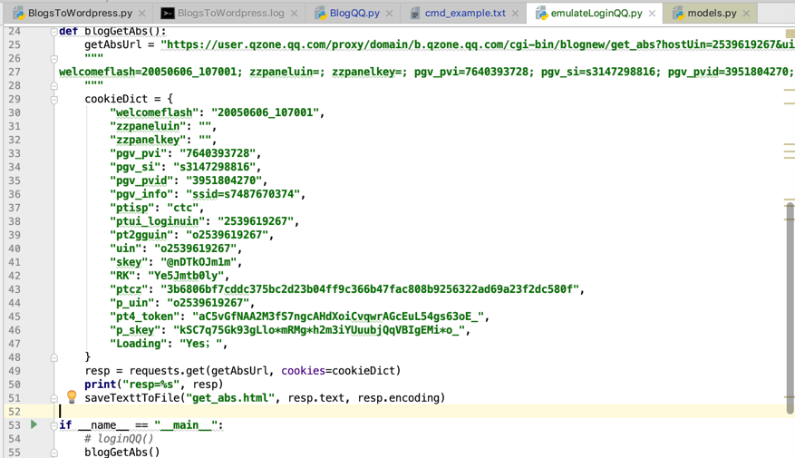

## 处理得到城市名称

除了：

[【整理】中国常见的城市的名字](https://www.crifan.com/china_common_city_name/)

以及：

对于：

https://en.wikipedia.org/wiki/List_of_urban_areas_by_population

中的城市名，用正则：

```bash
\[\d+\]

```

去除掉`[数字]`

从：

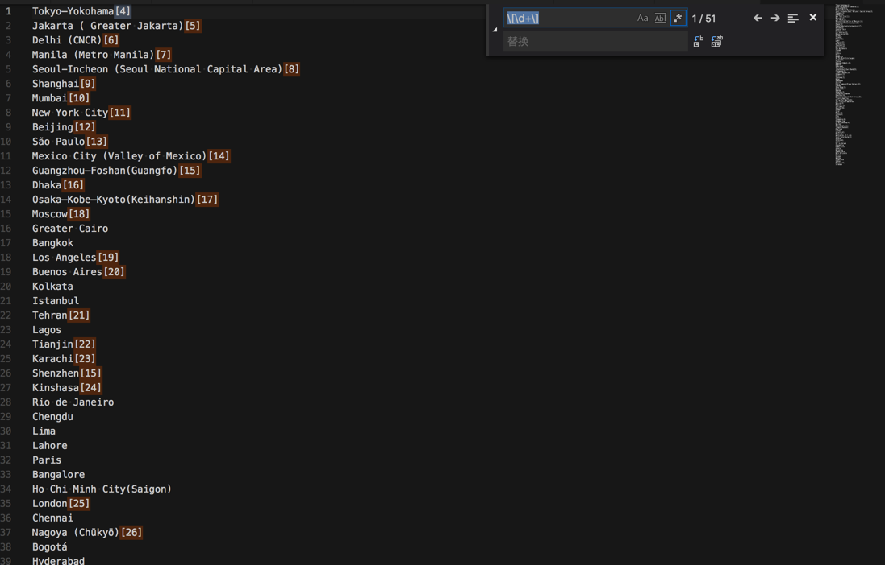

替换成：

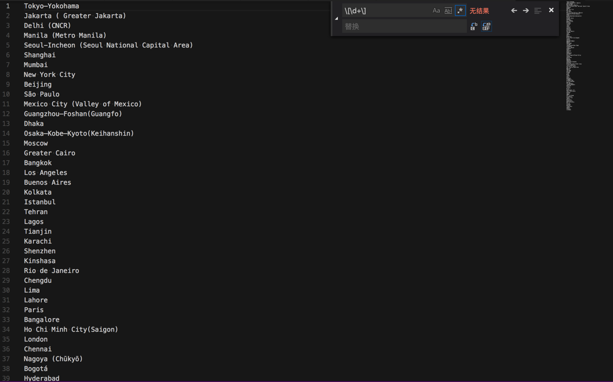

以及继续用：

```bash
\(([\w\s]+)\)$
$1
```

把`(xxx)`中的`xxx`放到下一行

从：

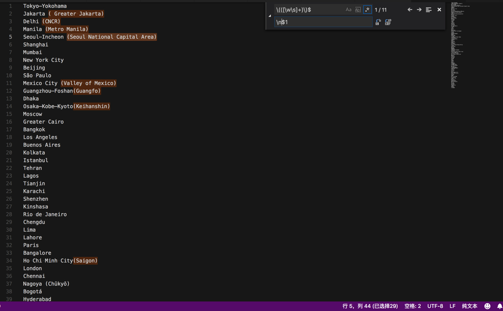

替换成：

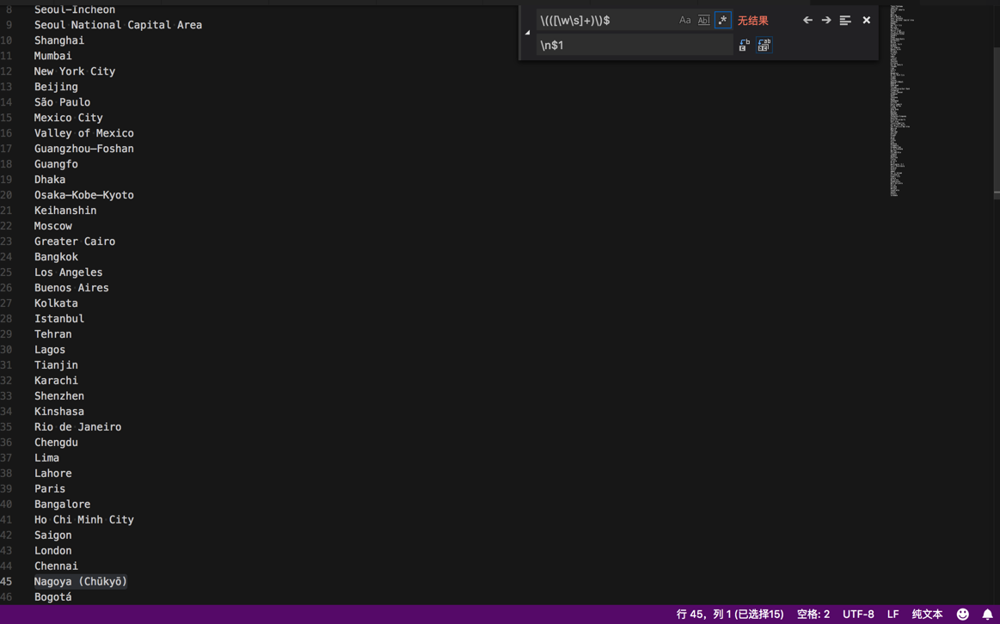

当然，也注意到了，没有匹配到：

`Nagoya (Chūkyō)`

是因为里面有unicode的字符，由于数量不多，手动处理即可。

再去用：

```bash
–([\w\s]+)
\n$1
```

把`xxx-yyy`中的`yyy`放到下一行

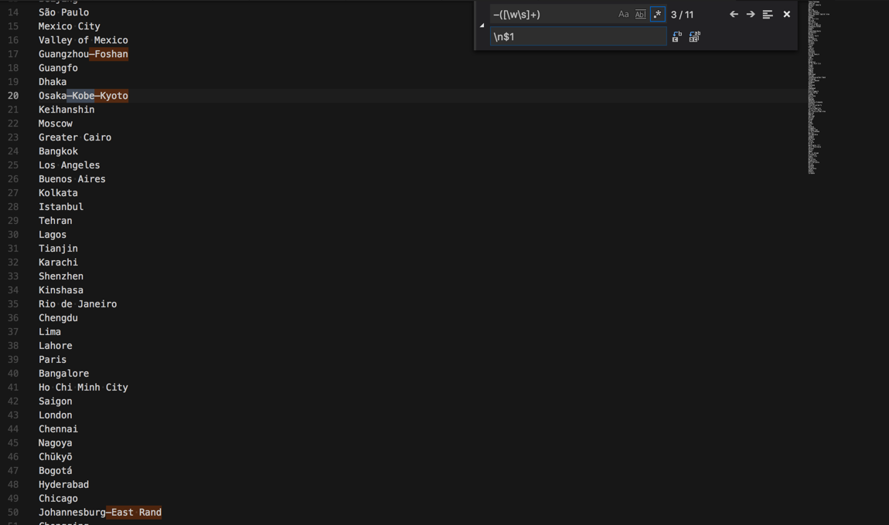

替换成：

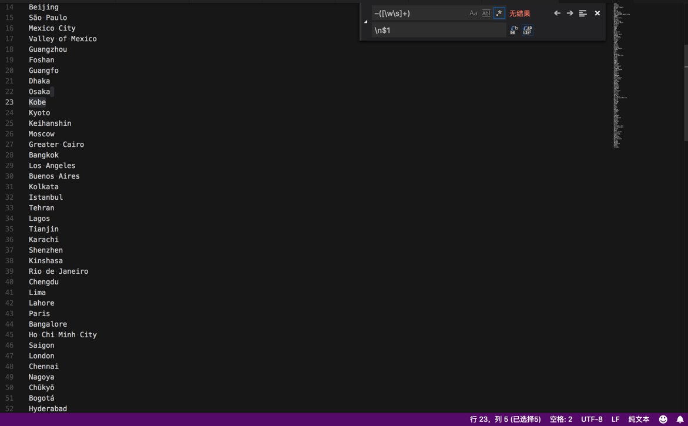

以及，用：

```bash
\s*\(.+\)$

```

把`xxx (yyy)`中的`空格(yyy)`去掉：

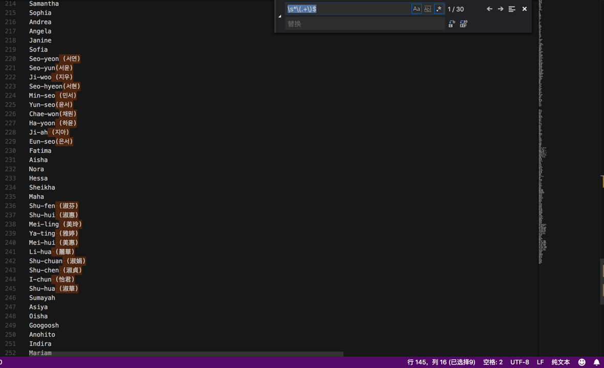

替换成：

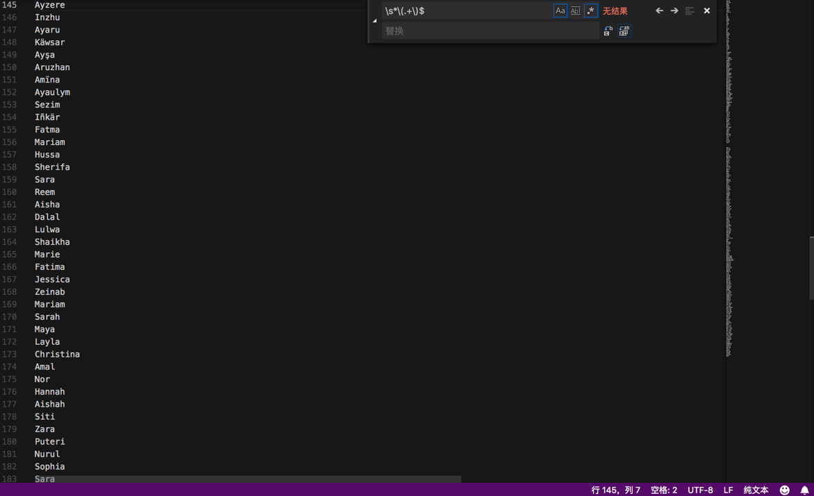

再继续，用：

```bash
^\s
\n
```

可以找到：

有哪些单词在行首有多余的空格（后续可以再去删除掉）：

![vscode_remove_start_empty.png)

## 提取mp3文件名和mp3链接地址

正则：

```bash
^[^\r\n]+href="(\w+\](../../../assets/img/vscode_remove_start_empty.png)

## 提取mp3文件名和mp3链接地址

正则：

```bash
^[^\r\n]+href="(\w+\.mp3)"[^\r\n]+$
$1
```

把：

```html
 <a href="e10d3a.mp3">e10d3a.mp3</a> 2015-09-23 09:10 9.3M
 <a href="e10d3b.mp3">e10d3b.mp3</a> 2015-09-23 09:10 7.0M
 <a href="e10d5a.mp3">e10d5a.mp3</a> 2015-09-23 09:11 54M
```

替换为：

```bash
e10d3a.mp3
e10d3b.mp3
e10d5a.mp3
```

再进一步：

用正则：

```bash
^[^\r\n]+href="(\w+\.mp3)"[^\r\n]+$
http://media.talkbank.org/CHILDES/Biling/Singapore/$1
```

从：

```html
 <a href="e10d3a.mp3">e10d3a.mp3</a> 2015-09-23 09:10 9.3M
 <a href="e10d3b.mp3">e10d3b.mp3</a> 2015-09-23 09:10 7.0M
 <a href="e10d5a.mp3">e10d5a.mp3</a> 2015-09-23 09:11 54M
```

替换和提取出：

```bash
http://media.talkbank.org/CHILDES/Biling/Singapore/e10d3a.mp3
http://media.talkbank.org/CHILDES/Biling/Singapore/e10d3b.mp3
http://media.talkbank.org/CHILDES/Biling/Singapore/e10d5a.mp3
```

详见：

[【已解决】VSCode中如何使用正则表达式去替换且被替换中使用分组group](http://www.crifan.com/vscode_use_regex_replace_using_group)

## 提取104协议示例数据，并格式化成java代码中字符串数组

从：

```bash
EB90EB90(端口号:21站0)[2020/1/6 18:18:58] 发送：
68 04 07 00 00 00 
EB90EB90(端口号:21站5)[2020/1/6 18:19:07] 接收：
68 12 E6 B7 00 00 0F 81 05 00 05 00 01 0C 00 95 42 03 00 00 
EB90EB90(端口号:21站5)[2020/1/6 18:19:07] 发送：
68 04 01 00 E6 B7 
EB90EB90(端口号:21站5)[2020/1/6 18:19:12] 接收：
68 14 E8 B7 00 00 01 87 14 00 05 00 01 00 00 01 01 01 00 00 00 01 
EB90EB90(端口号:21站5)[2020/1/6 18:19:12] 发送：
68 04 01 00 E8 B7 
EB90EB90(端口号:21站5)[2020/1/6 18:19:17] 接收：
68 59 EA B7 00 00 15 A6 14 00 05 00 01 07 00 02 00 00 00 00 00 EC 5C CB 5C DF 5C 45 00 01 00 FE FF 7C 00 94 02 00 00 00 00 00 00 00 00 00 00 00 00 00 00 00 00 00 00 00 00 00 00 00 00 00 00 86 13 00 00 02 00 00 00 00 00 FE FF 00 00 00 00 87 00 00 00 00 00 02 00 00 00 00 00 
...
EB90EB90(端口号:21站5)[2020/1/6 23:08:55] 发送：
68 04 01 00 12 D3 
EB90EB90(端口号:21站5)[2020/1/6 23:09:00] 接收：
68 59 14 D3 00 00 15 A6 14 00 05 00 01 07 00 02 00 00 00 00 00 BC 5D 88 5D A7 5D 44 00 01 00 FE FF 7C 00 84 02 00 00 00 00 00 00 00 00 00 00 00 00 00 00 00 00 00 00 00 00 00 00 00 00 00 00 88 13 00 00 02 00 00 00 00 00 FE FF 00 00 00 00 B6 00 00 00 00 00 02 00 00 00 00 00 
EB90EB90(端口号:21站5)[2020/1/6 23:09:06] 接收：
68 12 16 D3 00 00 0F 81 05 00 05 00 01 0C 00 B6 42 03 00 00 
EB90EB90(端口号:21站5)[2020/1/6 23:09:06] 发送：
68 04 01 00 16 D3 
```

提取出：接收：的下一行的一连串数字

（1）先 去除 发送的部分

正则：

```bash
^EB.+发送：\n(^.+)$\n

```

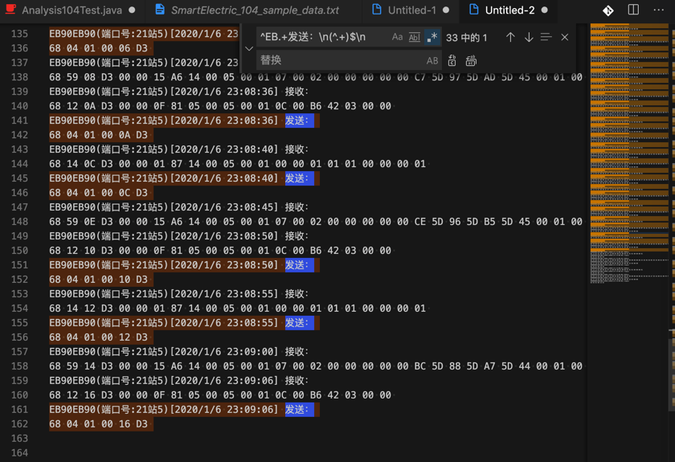

替换成：

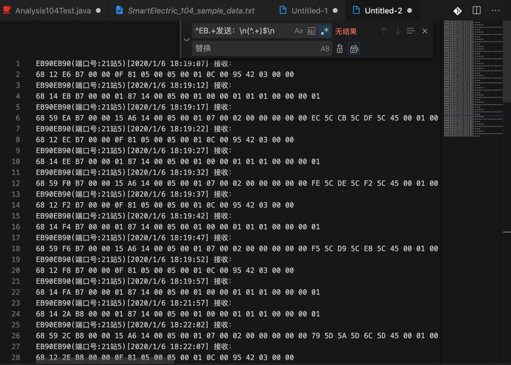

（2）再去把接收部分中数字提取出来

从：

```bash
EB90EB90(端口号:21站5)[2020/1/6 18:19:07] 接收：
68 12 E6 B7 00 00 0F 81 05 00 05 00 01 0C 00 95 42 03 00 00 
EB90EB90(端口号:21站5)[2020/1/6 18:19:12] 接收：
68 14 E8 B7 00 00 01 87 14 00 05 00 01 00 00 01 01 01 00 00 00 01 
...
EB90EB90(端口号:21站5)[2020/1/6 23:08:55] 接收：
68 14 12 D3 00 00 01 87 14 00 05 00 01 00 00 01 01 01 00 00 00 01 
EB90EB90(端口号:21站5)[2020/1/6 23:09:00] 接收：
68 59 14 D3 00 00 15 A6 14 00 05 00 01 07 00 02 00 00 00 00 00 BC 5D 88 5D A7 5D 44 00 01 00 FE FF 7C 00 84 02 00 00 00 00 00 00 00 00 00 00 00 00 00 00 00 00 00 00 00 00 00 00 00 00 00 00 88 13 00 00 02 00 00 00 00 00 FE FF 00 00 00 00 B6 00 00 00 00 00 02 00 00 00 00 00 
EB90EB90(端口号:21站5)[2020/1/6 23:09:06] 接收：
68 12 16 D3 00 00 0F 81 05 00 05 00 01 0C 00 B6 42 03 00 00 

```

用正则：

```bash
^EB.+接收：\n(^.+)$
$1
```

把：

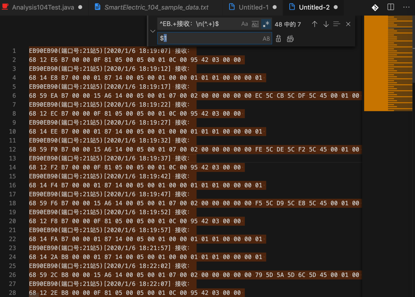

替换成：

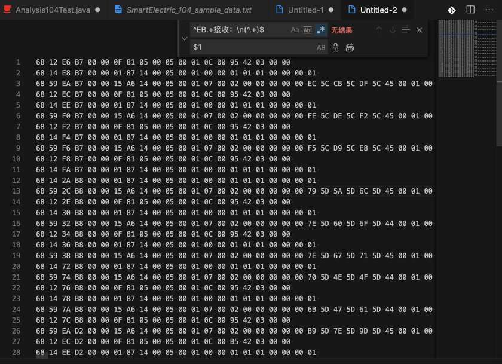

得到每一行的数字：

```bash
68 12 E6 B7 00 00 0F 81 05 00 05 00 01 0C 00 95 42 03 00 00 
68 14 E8 B7 00 00 01 87 14 00 05 00 01 00 00 01 01 01 00 00 00 01 
68 59 EA B7 00 00 15 A6 14 00 05 00 01 07 00 02 00 00 00 00 00 EC 5C CB 5C DF 5C 45 00 01 00 FE FF 7C 00 94 02 00 00 00 00 00 00 00 00 00 00 00 00 00 00 00 00 00 00 00 00 00 00 00 00 00 00 86 13 00 00 02 00 00 00 00 00 FE FF 00 00 00 00 87 00 00 00 00 00 02 00 00 00 00 00 
...
68 12 16 D3 00 00 0F 81 05 00 05 00 01 0C 00 B6 42 03 00 00 
```

（3）再去变成java字符串数组，即给每一行加上前后双引号

用正则：

```bash
^(.+)$
                "$1",
```

把：

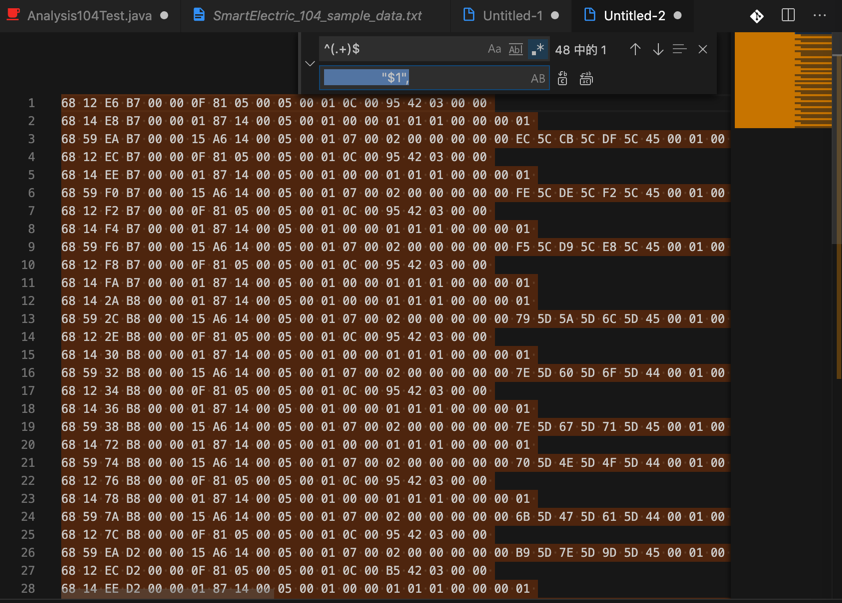

变成：

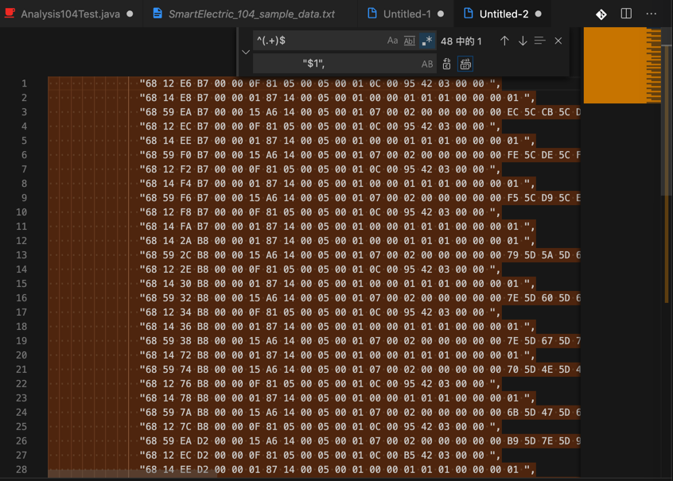

```bash
                "68 12 E6 B7 00 00 0F 81 05 00 05 00 01 0C 00 95 42 03 00 00 ",
                "68 14 E8 B7 00 00 01 87 14 00 05 00 01 00 00 01 01 01 00 00 00 01 ",
                "68 59 EA B7 00 00 15 A6 14 00 05 00 01 07 00 02 00 00 00 00 00 EC 5C CB 5C DF 5C 45 00 01 00 FE FF 7C 00 94 02 00 00 00 00 00 00 00 00 00 00 00 00 00 00 00 00 00 00 00 00 00 00 00 00 00 00 86 13 00 00 02 00 00 00 00 00 FE FF 00 00 00 00 87 00 00 00 00 00 02 00 00 00 00 00 ",
                "68 12 EC B7 00 00 0F 81 05 00 05 00 01 0C 00 95 42 03 00 00 ",
...
                "68 12 16 D3 00 00 0F 81 05 00 05 00 01 0C 00 B6 42 03 00 00 ",
```

用于粘贴到代码中使用：

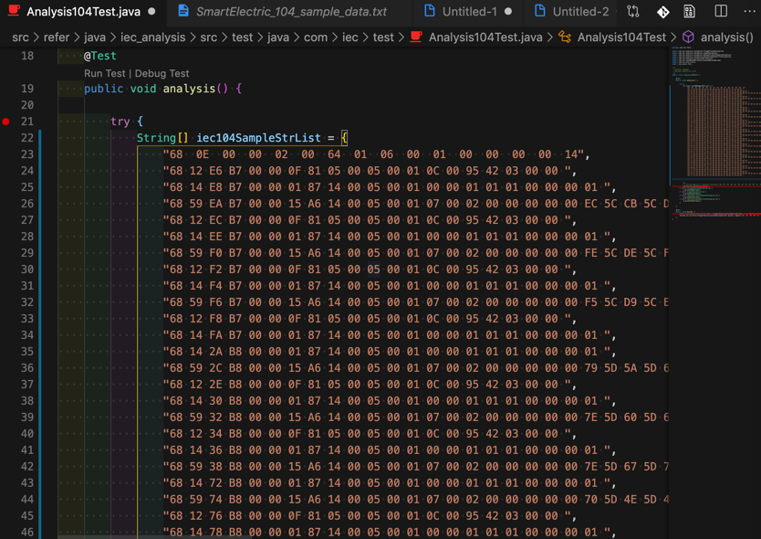

->从而把：

* 繁琐的，手工的，从原始文件中拷贝和粘贴的重复劳动，
* 快捷的，自动的，完成，且更准确，不会出现手动操作的失误。

## 填充Markdown中图片文件名

此处正在写教程期间，正好有个需求：为了避免和消除Markdown中的，关于图片的文件名即image的alt的text是空的警告：

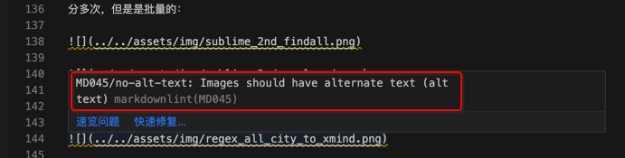

然后正好用正则，去自动填充此处image的alt的text，即图片的文件名

用正则：

```bash
!\[\]\(\.\./\.\./assets/img/([^/]+)\.(\w{3})\)

```

把：

```bash
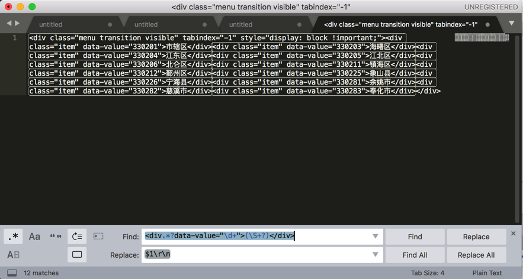

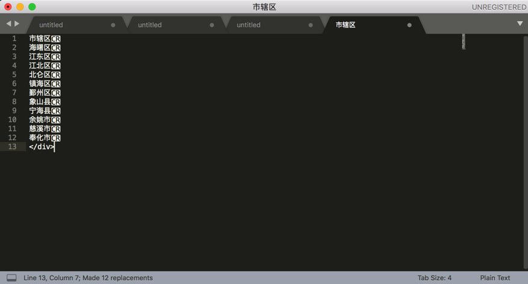

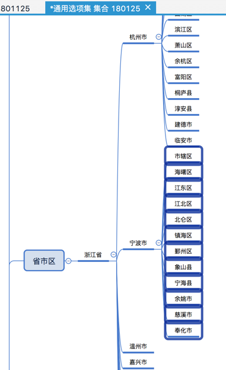
```

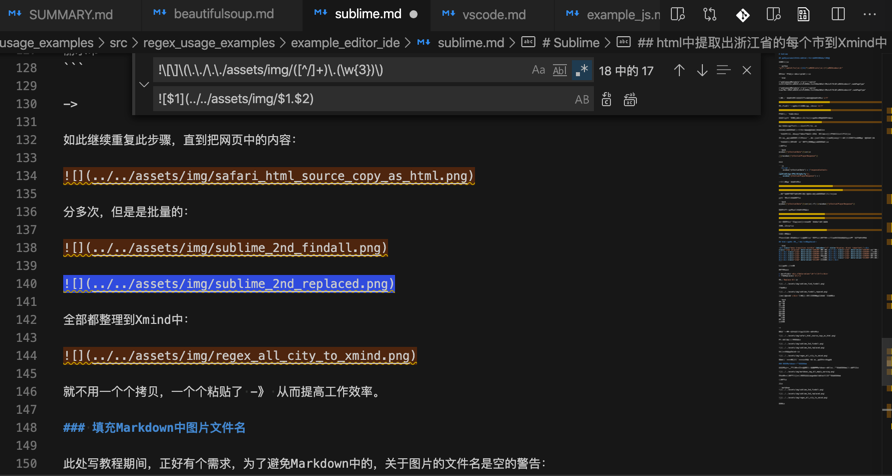

变成：

```bash


```

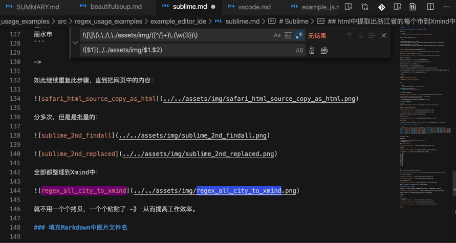

即可自动填充image的alt的text，消除Markdown中的警告了。

## 把xml中非法的大于号和小于号替换掉

用正则批量替换：

```bash
Callback<([\w\.]+)>
Callback&lt;$1&gt;
```

从：

```xml
  <item name="android.accounts.AccountManager android.accounts.AccountManagerFuture&lt;android.os.Bundle&gt; removeAccount(android.accounts.Account, android.app.Activity, android.accounts.AccountManagerCallback<android.os.Bundle>, android.os.Handler)">
...
  <item name="android.accounts.AccountManager android.accounts.AccountManagerFuture&lt;android.os.Bundle&gt; updateCredentials(android.accounts.Account, java.lang.String, android.os.Bundle, android.app.Activity, android.accounts.AccountManagerCallback<android.os.Bundle>, android.os.Handler)”>
...
```

替换成：

```xml
  <item name="android.accounts.AccountManager android.accounts.AccountManagerFuture&lt;android.os.Bundle&gt; removeAccount(android.accounts.Account, android.app.Activity, android.accounts.AccountManagerCallback&lt;android.os.Bundle&gt;, android.os.Handler)”>
...
  <item name="android.accounts.AccountManager android.accounts.AccountManagerFuture&lt;android.os.Bundle&gt; updateCredentials(android.accounts.Account, java.lang.String, android.os.Bundle, android.app.Activity, android.accounts.AccountManagerCallback&lt;android.os.Bundle&gt;, android.os.Handler)">
```

以及更加复杂一点的：

`Android/sdk/platform-tools/api/android/hardware/camera2/annotations.xml`

```xml
  <item name="android.hardware.camera2.CameraDevice android.hardware.camera2.CaptureRequest.Builder createCaptureRequest(int, java.util.Set<java.lang.String>) 0">
    <annotation name="androidx.annotation.IntDef">
      <val name="value" val="{android.hardware.camera2.CameraDevice.TEMPLATE_PREVIEW, android.hardware.camera2.CameraDevice.TEMPLATE_STILL_CAPTURE, android.hardware.camera2.CameraDevice.TEMPLATE_RECORD, android.hardware.camera2.CameraDevice.TEMPLATE_VIDEO_SNAPSHOT, android.hardware.camera2.CameraDevice.TEMPLATE_ZERO_SHUTTER_LAG, android.hardware.camera2.CameraDevice.TEMPLATE_MANUAL}" />
    </annotation>
  </item>
```

要把其中的：

```xml
java.util.Set<java.lang.String>
```

替换成：

```xml
java.util.Set&lt;java.lang.String&gt;
```

且，又不想

* 很傻的把前缀写成固定的：`java.util.Set`
  * 这样前缀换了，就不支持了
    * 虽然此处只有这一个例子，但是还是应该写的更加通用
* 以及后续打算放到全局去替换的
  * 所以要写成通用的

参考自己教程

[环视断言 · 应用广泛的超强搜索：正则表达式](https://book.crifan.com/books/super_search_regex/website/regex_syntax/look_around/)

```bash
(?=xxx): (positive) look ahead (assertion)=正向肯定断言
(?!xxx): negative look ahead (assertion)=正向否定断言
(?<=xxx): (positive) look behind (assertion)=反向肯定断言
(?<!xxx): negative look behind (assertion)=反向否定断言
```

然后去写成：

```bash
(?<!\s)<([\.\w]+)>
&lt;$1&gt;
```

即可：只识别中间内容，不会误判

可以把：

```xml
  <item name="android.hardware.camera2.CameraDevice android.hardware.camera2.CaptureRequest.Builder createCaptureRequest(int, java.util.Set<java.lang.String>) 0">
```

替换成：

```xml
  <item name="android.hardware.camera2.CameraDevice android.hardware.camera2.CaptureRequest.Builder createCaptureRequest(int, java.util.Set&lt;java.lang.String&gt;) 0">
```

## 把表格文字用正则处理成markdown表格，用于生成html后，拷贝出真正表格

从某网站 [Android应用加固原理 - 简书](https://www.jianshu.com/p/4ff48b761ff6)，希望拷贝出 表格，但是只是拷贝出文字：

```bash
风险名称    风险    解决方案
1.App防止反编译    被反编译的暴露客户端逻辑，加密算法，密钥，等等    加固
2.java层代码源代码反编译风险    被反编译的暴露客户端逻辑，加密算法，密钥，等等    加固 ，混淆
3.so文件破解风险    导致核心代码泄漏。    so文件加固
4.篡改和二次打包风险    修改文件资源等，二次打包的添加病毒，广告，或者窃取支付密码，拦截短信等    资源文件混淆和校验签名的hash值
5.资源文件泄露风险    获取图片，js文件等文件，通过植入病毒，钓鱼页面获取用户敏感信息    资源混淆，加固等等
6.应用签名未交验风险    反编译或者二次打包，添加病毒代码，恶意代码，上传盗版App    对App进行签名证书校验
7.代码为混淆风险    业务逻辑暴露，加密算法，账号信息等等。    混淆（中文混淆）
8.webview明文存储密码风险    用户使用webview默认存储密码到databases/webview.db root的手机可以产看webview数据库，获取用户敏感信息    关闭wenview存储密码功能
9.明文数字证书风险    APK使用的数字证书用来校验服务器的合法性，保证数据的保密性和完成性 明文存储的证书被篡改造成数据被获取等    客户端校验服务器域名和数字证书等
10.调试日志函数调用风险    日志信息里面含有用户敏感信息等    关闭调试日志函数，删除打印的日志信息
11.AES/DES加密方法不安全使用风险    在使用AES/DES加密使用了ECB或者OFB工作模式，加密数据被选择明文攻击破解等    使用CBC和CFB工作模式等
12.RSA加密算法不安全风险    密数据被选择明文攻击破解和中间人攻击等导致用户敏感信息泄露    密码不要太短，使用正确的工作模式
13.密钥硬编码风险    用户使用加密算法的密钥设置成一个固定值导致密钥泄漏    动态生成加密密钥或者将密钥进程分段存储等
14.动态调试攻击风险    攻击者使用GDB，IDA调试追踪目标程序，获取用户敏感信息等    在so文件里面实现对调试进程的监听
15.应用数据任意备份风险    AndroidMainfest中allowBackup=true 攻击者可以使用adb命令对APP应用数据进行备份造成用户数据泄露    allowBackup=false
16.全局可读写内部文件风险。    实现不同软件之间数据共享，设置内部文件全局可读写造成其他应用也可以读取或者修改文件等    （1）.使用MODE_PRIVATE模式创建内部存储文件（2）.加密存储敏感数据3.避免在文件中存储明文和敏感信息
17.SharedPrefs全局可读写内部文件风险。    被其他应用读取或者修改文件等    使用正确的权限
18.Internal Storage数据全局可读写风险    当设置MODE_WORLD_READBLE或者设置android:sharedUserId导致敏感信息被其他应用程序读取等    设置正确的模式等
19.getDir数据全局可读写风险    当设置MODE_WORLD_READBLE或者设置android:sharedUserId导致敏感信息被其他应用程序读取等    设置正确的模式等
20.java层动态调试风险    AndroidManifest中调试的标记可以使用jdb进行调试，窃取用户敏感信息。    android：debuggable=“false”
21.内网测试信息残留风险    通过测试的Url，测试账号等对正式服务器进行攻击等    讲测试内网的日志清除，或者测试服务器和生产服务器不要使用同一个
22.随机数不安全使用风险    在使用SecureRandom类来生成随机数，其实并不是随机，导致使用的随机数和加密算法被破解。    （1）不使用setSeed方法（2）使用/dev/urandom或者/dev/random来初始化伪随机数生成器
23.Http传输数据风险    未加密的数据被第三方获取，造成数据泄露    使用Hpps
24.Htpps未校验服务器证书风险，Https未校验主机名风险，Https允许任意主机名风险    客户端没有对服务器进行身份完整性校验，造成中间人攻击    （1）.在X509TrustManager中的checkServerTrusted方法对服务器进行校验（2）.判断证书是否过期（3）.使用HostnameVerifier类检查证书中的主机名与使用证书的主机名是否一致
25.webview绕过证书校验风险    webview使用https协议加密的url没有校验服务器导致中间人攻击    校验服务器证书时候正确
26.界面劫持风险    用户输入密码的时候被一个假冒的页面遮挡获取用户信息等    （1）.使用第三方专业防界面劫持SDK（2）.校验当前是否是自己的页面
27.输入监听风险    用户输入的信息被监听或者按键位置被监听造成用户信息泄露等    自定义键盘
28.截屏攻击风险    对APP运行中的界面进行截图或者录制来获取用户信息    添加属性getWindow().setFlags(FLAG_SECURE)不让用户截图和录屏
29.动态注册Receiver风险    当动态注册Receiver默认生命周期是可以导出的可以被任意应用访问    使用带权限检验的registerReceiver API进行动态广播的注册
30.Content Provider数据泄露风险    权限设置不当导致用户信息    正确的使用权限
31.Service ，Activity，Broadcast,content provider组件导出风险    Activity被第三方应用访问导致被任意应用恶意调用    自定义权限
32.PendingIntent错误使用Intent风险    使用PendingIntent的时候，如果使用了一个空Intent，会导致恶意用户劫持修改Intent的内容    禁止使用一个空Intent去构造PendingIntent
33.Intent组件隐式调用风险    使用隐式Intent没有对接收端进行限制导致敏感信息被劫持    1.对接收端进行限制 2.建议使用显示调用方式发送Intent
34.Intent Scheme URL攻击风险    webview恶意调用App    对Intent做安全限制
35.Fragment注入攻击风险    出的PreferenceActivity的子类中，没有加入isValidFragment方法，进行fragment名的合法性校验，攻击者可能会绕过限制，访问未授权的界面    （1）.如果应用的Activity组件不必要导出，或者组件配置了intent filter标签，建议显示设置组件的“android:exported”属性为false（2）.重写isValidFragment方法，验证fragment来源的正确性
36.webview远程代码执行风险    风险：WebView.addJavascriptInterface方法注册可供JavaScript调用的Java对象，通过反射调用其他java类等    建议不使用addJavascriptInterface接口，对于Android API Level为17或者以上的Android系统，Google规定允许被调用的函数，必须在Java的远程方法上面声明一个@JavascriptInterface注解
37.zip文件解压目录遍历风险    Java代码在解压ZIP文件时，会使用到ZipEntry类的getName()方法，如果ZIP文件中包含“../”的字符串，该方法返回值里面原样返回，如果没有过滤掉getName()返回值中的“../”字符串，继续解压缩操作，就会在其他目录中创建解压的文件    （1）. 对重要的ZIP压缩包文件进行数字签名校验，校验通过才进行解压。 （2）. 检查Zip压缩包中使用ZipEntry.getName()获取的文件名中是否包含”../”或者”..”，检查”../”的时候不必进行URI Decode（以防通过URI编码”..%2F”来进行绕过），测试发现ZipEntry.getName()对于Zip包中有“..%2F”的文件路径不会进行处理。
38.Root设备运行风险    已经root的手机通过获取应用的敏感信息等    检测是否是root的手机禁止应用启动
39.模拟器运行风险    刷单，模拟虚拟位置等    禁止在虚拟器上运行
40.从sdcard加载Dex和so风险    未对Dex和So文件进行安全，完整性及校验，导致被替换，造成用户敏感信息泄露    （1）.放在APP的私有目录 （2）.对文件进行完成性校验。

```

然后希望处理成markdown

用正则替换：

```bash
(.+?)\t(.+?)\t(.+?)$
|$1|$2|$3|
```

后记：
此处`\t`的`Tab`粘贴过来已变成`空格`=`space`了，所以改为：

```bash
(.+?)\s+(.+?)\s+(.+?)$
|$1|$2|$3|
```

效果：

从：

【此处由于印象笔记冲突导致帖子图片丢失】

变成：

【此处由于印象笔记冲突导致帖子图片丢失】

保存成 md文件，再去用VSCode中Markdown插件生成html或pdf

不过要加上一个表格的内容

```bash
| -----|----| -----|
```

打开效果：

【此处由于印象笔记冲突导致帖子图片丢失】

然后也方便，拷贝到别处，是个表格：

比如拷贝到印象笔记中：

【此处由于印象笔记冲突导致帖子图片丢失】

## 把url中query parameter分出来

折腾：

【未解决】爬取mp.codeup.cn中的英语教材电子书资源

期间，对于：

```bash
http://mp.codeup.cn/book/sample2.htm?id=52365&shelfId=4824&share_=6765370&sh=sh&vt_=1583111113754&_logined=1
```

想要把参数分出来

用正则：

```bash
[&?](.+?)=([^&=]+)
\n$1 = $2
```

从：

【此处由于印象笔记冲突导致帖子图片丢失】

变成：

```bash
http://mp.codeup.cn/book/sample2.htm
id = 52365
shelfId = 4824
share_ = 6765370
sh = sh
vt_ = 1583111113754
_logined = 1
```

除了第一行，剩下的就是我们要的`key=value`形式了。
