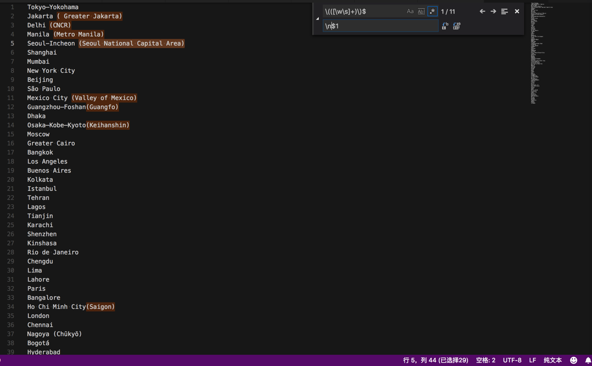
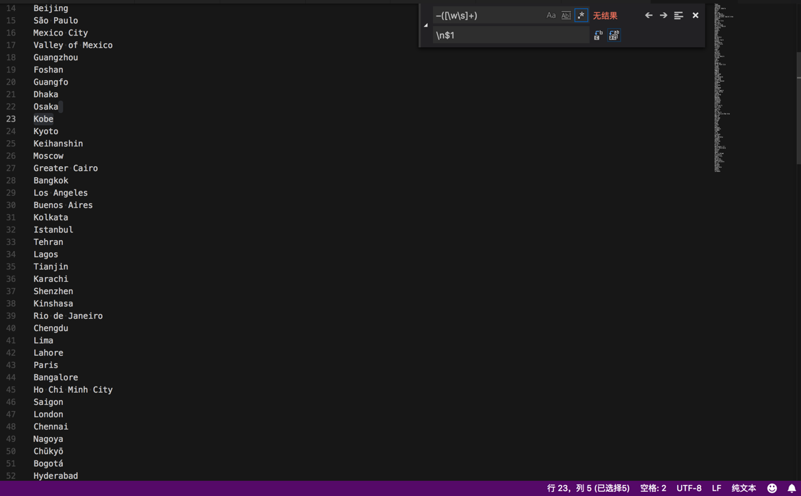
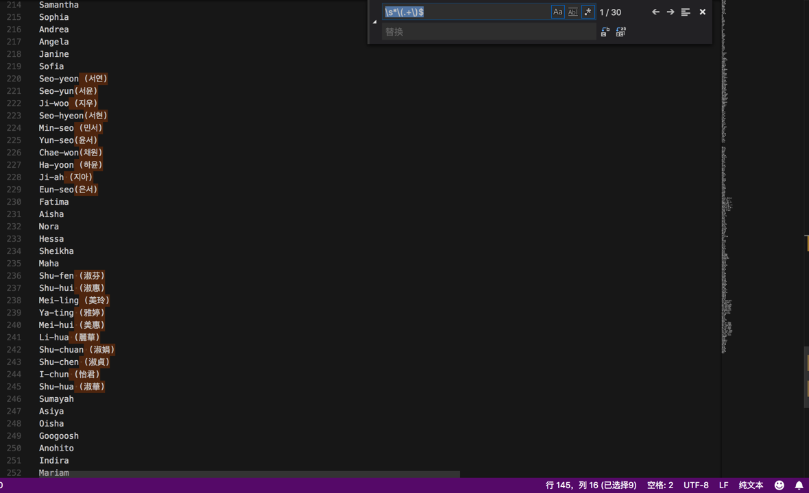

# 处理得到城市名称

除了：

[【整理】中国常见的城市的名字](https://www.crifan.com/china_common_city_name/)

以及：

对于：

https://en.wikipedia.org/wiki/List_of_urban_areas_by_population

中的城市名，用正则：

```bash
\[\d+\]

```

去除掉`[数字]`

从：


替换成：


以及继续用：

```bash
\(([\w\s]+)\)$
$1
```

把`(xxx)`中的`xxx`放到下一行

从：



替换成：


当然，也注意到了，没有匹配到：

`Nagoya (Chūkyō)`

是因为里面有unicode的字符，由于数量不多，手动处理即可。

再去用：

```bash
–([\w\s]+)
\n$1
```

把`xxx-yyy`中的`yyy`放到下一行


替换成：



以及，用：

```bash
\s*\(.+\)$

```

把`xxx (yyy)`中的`空格(yyy)`去掉：



替换成：


再继续，用：

```bash
^\s
\n
```

可以找到：

有哪些单词在行首有多余的空格（后续可以再去删除掉）：

![vscode_remove_start_empty.png)
