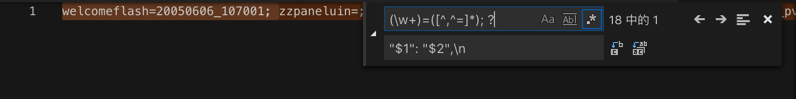

# 将Chrome中拷贝出来的cookie处理成代码中要的dict

Chrome中拷贝出来的cookie是：

```bash
welcomeflash=20050606_107001; zzpaneluin=; zzpanelkey=; pgv_pvi=7640393728; pgv_si=s3147298816; pgv_pvid=3951804270; pgv_info=ssid=s7487670374; ptisp=ctc; ptui_loginuin=2539619267; pt2gguin=o2539619267; uin=o2539619267; skey=@nDTkOJm1m; RK=Ye5Jmtb0ly; ptcz=3b6806bf7cddc375bc2d23b04ff9c366b47fac808b9256322ad69a23f2dc580f; p_uin=o2539619267; pt4_token=aC5vGfNAA2M3fS7ngcAHdXoiCvqwrAGcEuL54gs63oE_; p_skey=kSC7q75Gk93gLlo*mRMg*h2m3iYUuubjQqVBIgEMi*o_; Loading=Yes
```

最后加上分号：

```bash
welcomeflash=20050606_107001; zzpaneluin=; zzpanelkey=; pgv_pvi=7640393728; pgv_si=s3147298816; pgv_pvid=3951804270; pgv_info=ssid=s7487670374; ptisp=ctc; ptui_loginuin=2539619267; pt2gguin=o2539619267; uin=o2539619267; skey=@nDTkOJm1m; RK=Ye5Jmtb0ly; ptcz=3b6806bf7cddc375bc2d23b04ff9c366b47fac808b9256322ad69a23f2dc580f; p_uin=o2539619267; pt4_token=aC5vGfNAA2M3fS7ngcAHdXoiCvqwrAGcEuL54gs63oE_; p_skey=kSC7q75Gk93gLlo*mRMg*h2m3iYUuubjQqVBIgEMi*o_; Loading=Yes;
```

再去用正则：

```bash
(\w+)=([^,^=]*); ?
"$1": "$2",\n
```

替换：



成自己要的dict的内容：


中间有个特殊的，自己手动改一下即可：

```bash
"welcomeflash": "20050606_107001",
"zzpaneluin": "",
"zzpanelkey": "",
"pgv_pvi": "7640393728",
"pgv_si": "s3147298816",
"pgv_pvid": "3951804270",
"pgv_info": "ssid=s7487670374",
"ptisp": "ctc",
"ptui_loginuin": "2539619267",
"pt2gguin": "o2539619267",
"uin": "o2539619267",
"skey": "@nDTkOJm1m",
"RK": "Ye5Jmtb0ly",
"ptcz": "3b6806bf7cddc375bc2d23b04ff9c366b47fac808b9256322ad69a23f2dc580f",
"p_uin": "o2539619267",
"pt4_token": "aC5vGfNAA2M3fS7ngcAHdXoiCvqwrAGcEuL54gs63oE_",
"p_skey": "kSC7q75Gk93gLlo*mRMg*h2m3iYUuubjQqVBIgEMi*o_",
"Loading": "Yes;",
```

粘贴到代码中即可使用了：


