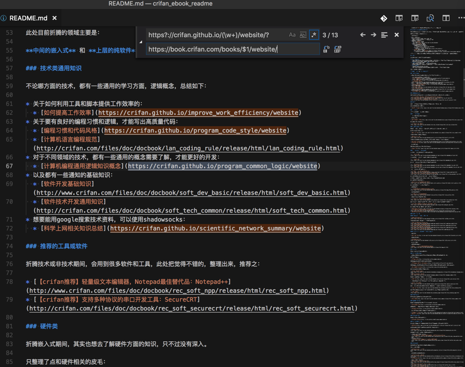
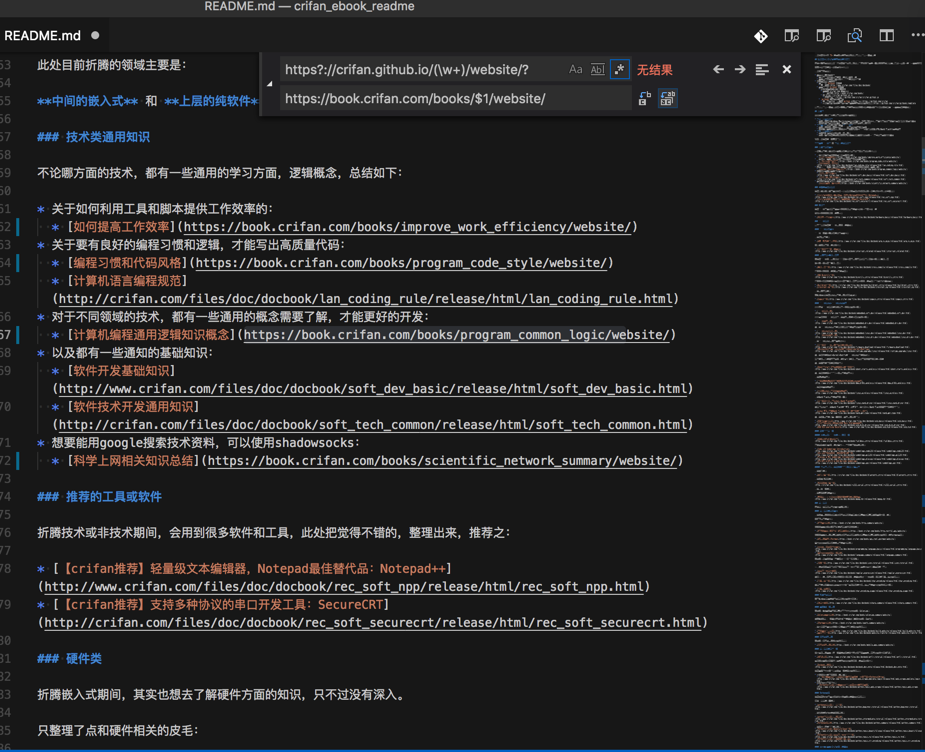

# crifan电子书中链接替换

对于我的电子书的说明：

https://github.com/crifan/crifan_ebook_readme

的markdown源码：


想要把其中的地址：

`https://crifan.github.io/xxx/website`

替换为：

`https://book.crifan.com/books/xxx/website/`

比如：

`https://crifan.github.io/program_code_style/website`

替换成：

`https://book.crifan.com/books/program_code_style/website/`

用正则：

```bash
https?://crifan.github.io/(\w+)/website/?
https://book.crifan.com/books/$1/website/
```

实现从：



替换成：


