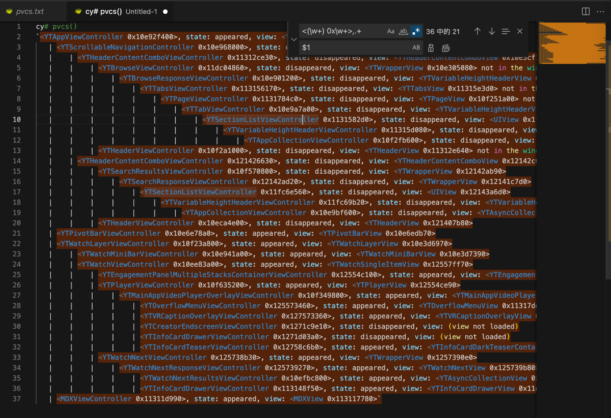
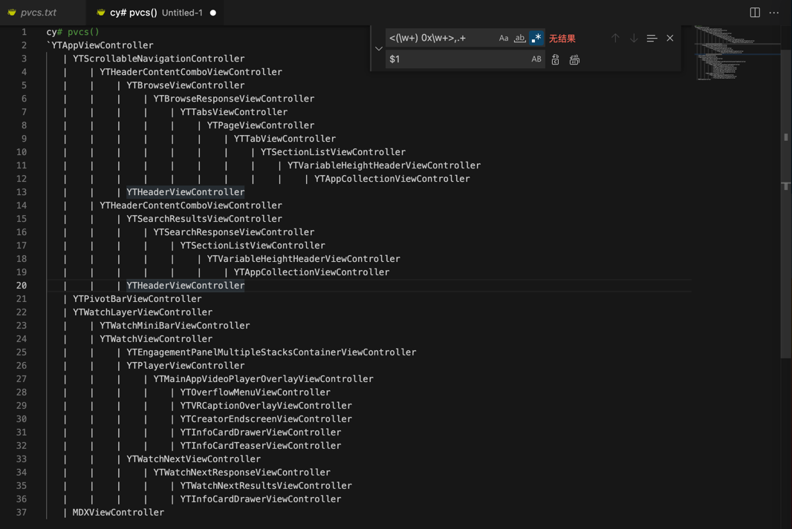

# Cycript输出的类的详细信息去掉细节只保留类名

正则：

```bash
<(\w+) 0x\w+>,.+

$1
```

替换前：

```bash
cy# pvcs()
`<YTAppViewController 0x10e92f400>, state: appeared, view: <YTAppView 0x10e3d2000>
   | <YTScrollableNavigationController 0x10e968000>, state: disappeared, view: <UILayoutContainerView 0x10e3d33e0>
   |    | <YTHeaderContentComboViewController 0x11312ce30>, state: disappeared, view: <YTHeaderContentComboView 0x10e3cf180> not in the window
   |    |    | <YTBrowseViewController 0x11dc04860>, state: disappeared, view: <YTWrapperView 0x10e305080> not in the window
   |    |    |    | <YTBrowseResponseViewController 0x10e901200>, state: disappeared, view: <YTVariableHeightHeaderView 0x10e6bd020> not in the window
   |    |    |    |    | <YTTabsViewController 0x113156170>, state: disappeared, view: <YTTabsView 0x11315e3d0> not in the window
   |    |    |    |    |    | <YTPageViewController 0x1131784c0>, state: disappeared, view: <YTPageView 0x10f251a00> not in the window
   |    |    |    |    |    |    | <YTTabViewController 0x10e9a7a00>, state: disappeared, view: <YTVariableHeightHeaderView 0x10e3c6240> not in the window
   |    |    |    |    |    |    |    | <YTSectionListViewController 0x1131582d0>, state: disappeared, view: <UIView 0x113182c20> not in the window
   |    |    |    |    |    |    |    |    | <YTVariableHeightHeaderViewController 0x11315d080>, state: disappeared, view: <YTVariableHeightHeaderView 0x1131586a0> not in the window
   |    |    |    |    |    |    |    |    |    | <YTAppCollectionViewController 0x10f2fb600>, state: disappeared, view: <YTAsyncCollectionView 0x10f307000> not in the window
   |    |    | <YTHeaderViewController 0x10f2a1000>, state: disappeared, view: <YTHeaderView 0x11312e640> not in the window
   |    | <YTHeaderContentComboViewController 0x121426630>, state: disappeared, view: <YTHeaderContentComboView 0x12142c0a0>
   |    |    | <YTSearchResultsViewController 0x10f570800>, state: disappeared, view: <YTWrapperView 0x12142ab90>
   |    |    |    | <YTSearchResponseViewController 0x12142ad20>, state: disappeared, view: <YTWrapperView 0x12141c7d0>
   |    |    |    |    | <YTSectionListViewController 0x11fc6e560>, state: disappeared, view: <UIView 0x12143a6d0>
   |    |    |    |    |    | <YTVariableHeightHeaderViewController 0x11fc69b20>, state: disappeared, view: <YTVariableHeightHeaderView 0x1131e5950>
   |    |    |    |    |    |    | <YTAppCollectionViewController 0x10e9bf600>, state: disappeared, view: <YTAsyncCollectionView 0x10ecc3e00>
   |    |    | <YTHeaderViewController 0x10eca4e00>, state: disappeared, view: <YTHeaderView 0x121407b80>
   | <YTPivotBarViewController 0x10e6e78a0>, state: appeared, view: <YTPivotBarView 0x10e6edb70>
   | <YTWatchLayerViewController 0x10f23a800>, state: appeared, view: <YTWatchLayerView 0x10e3d6970>
   |    | <YTWatchMiniBarViewController 0x10e941a00>, state: appeared, view: <YTWatchMiniBarView 0x10e3d7390>
   |    | <YTWatchViewController 0x10ee83a00>, state: appeared, view: <YTWatchSingleItemView 0x12557ff70>
   |    |    | <YTEngagementPanelMultipleStacksContainerViewController 0x12554c100>, state: appeared, view: <YTEngagementPanelMultipleStacksContainerView 0x12559a850>
   |    |    | <YTPlayerViewController 0x10f635200>, state: appeared, view: <YTPlayerView 0x12554ce90>
   |    |    |    | <YTMainAppVideoPlayerOverlayViewController 0x10f349800>, state: appeared, view: <YTMainAppVideoPlayerOverlayView 0x12554fea0>
   |    |    |    |    | <YTOverflowMenuViewController 0x125573460>, state: appeared, view: <YTOverflowMenuView 0x11317dd20>
   |    |    |    |    | <YTVRCaptionOverlayViewController 0x127573360>, state: appeared, view: <YTVRCaptionOverlayView 0x113139d90>
   |    |    |    |    | <YTCreatorEndscreenViewController 0x1271c9e10>, state: disappeared, view: (view not loaded)
   |    |    |    |    | <YTInfoCardDrawerViewController 0x1271d03a0>, state: disappeared, view: (view not loaded)
   |    |    |    |    | <YTInfoCardTeaserViewController 0x12758c6b0>, state: appeared, view: <YTInfoCardDarkTeaserContainerView 0x1271d1310>
   |    |    | <YTWatchNextViewController 0x125738b30>, state: appeared, view: <YTWrapperView 0x1257390e0>
   |    |    |    | <YTWatchNextResponseViewController 0x125739270>, state: appeared, view: <YTWatchNextView 0x125739b80>
   |    |    |    |    | <YTWatchNextResultsViewController 0x10efbc800>, state: appeared, view: <YTAsyncCollectionView 0x10efa7000>
   |    |    |    |    | <YTInfoCardDrawerViewController 0x113148f50>, state: appeared, view: <YTInfoCardDrawerView 0x11dc3a060>
   | <MDXViewController 0x11311d990>, state: appeared, view: <MDXView 0x113117780>`
```



替换后：

```bash
cy# pvcs()
`YTAppViewController
   | YTScrollableNavigationController
   |    | YTHeaderContentComboViewController
   |    |    | YTBrowseViewController
   |    |    |    | YTBrowseResponseViewController
   |    |    |    |    | YTTabsViewController
   |    |    |    |    |    | YTPageViewController
   |    |    |    |    |    |    | YTTabViewController
   |    |    |    |    |    |    |    | YTSectionListViewController
   |    |    |    |    |    |    |    |    | YTVariableHeightHeaderViewController
   |    |    |    |    |    |    |    |    |    | YTAppCollectionViewController
   |    |    | YTHeaderViewController
   |    | YTHeaderContentComboViewController
   |    |    | YTSearchResultsViewController
   |    |    |    | YTSearchResponseViewController
   |    |    |    |    | YTSectionListViewController
   |    |    |    |    |    | YTVariableHeightHeaderViewController
   |    |    |    |    |    |    | YTAppCollectionViewController
   |    |    | YTHeaderViewController
   | YTPivotBarViewController
   | YTWatchLayerViewController
   |    | YTWatchMiniBarViewController
   |    | YTWatchViewController
   |    |    | YTEngagementPanelMultipleStacksContainerViewController
   |    |    | YTPlayerViewController
   |    |    |    | YTMainAppVideoPlayerOverlayViewController
   |    |    |    |    | YTOverflowMenuViewController
   |    |    |    |    | YTVRCaptionOverlayViewController
   |    |    |    |    | YTCreatorEndscreenViewController
   |    |    |    |    | YTInfoCardDrawerViewController
   |    |    |    |    | YTInfoCardTeaserViewController
   |    |    | YTWatchNextViewController
   |    |    |    | YTWatchNextResponseViewController
   |    |    |    |    | YTWatchNextResultsViewController
   |    |    |    |    | YTInfoCardDrawerViewController
   | MDXViewController
```



-》即可得到很清晰的，UI页面的类的层级关系，且只关心类名
