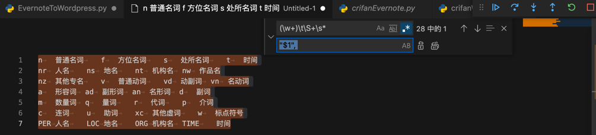
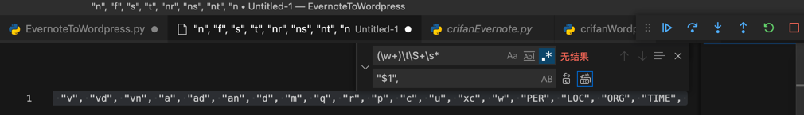

# 生成POS列表

正则：

```bash
(\w+)\t\S+\s*
"$1", 
```

把：

https://github.com/fxsjy/jieba

拷贝得到的：

```bash
n    普通名词    f    方位名词    s    处所名词    t    时间
nr    人名    ns    地名    nt    机构名    nw    作品名
nz    其他专名    v    普通动词    vd    动副词    vn    名动词
a    形容词    ad    副形词    an    名形词    d    副词
m    数量词    q    量词    r    代词    p    介词
c    连词    u    助词    xc    其他虚词    w    标点符号
PER    人名    LOC    地名    ORG    机构名    TIME    时间
```



变成：

```c
"n", "f", "s", "t", "nr", "ns", "nt", "nw", "nz", "v", "vd", "vn", "a", "ad", "an", "d", "m", "q", "r", "p", "c", "u", "xc", "w", "PER", "LOC", "ORG", "TIME",
```



放到代码中：

```c
        curPOS = ("n", "f", "s", "t", "nr", "ns", "nt", "nw", "nz", "v", "vd", "vn", "a", "ad", "an", "d", "m", "q", "r", "p", "c", "u", "xc", "w", "PER", "LOC", "ORG", "TIME")
        topTagList = jieba.analyse.extract_tags(noteStr, topK=10, withWeight=True, allowPOS=curPOS)
```

去使用。