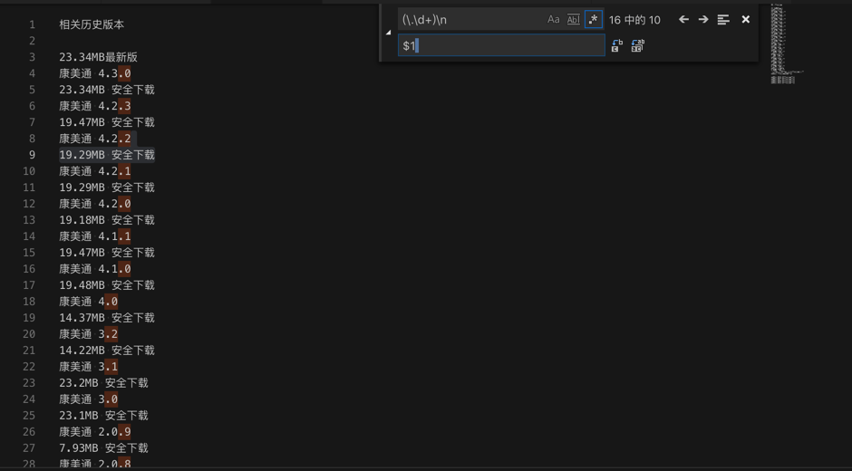

# 获取到康美通的版本历史

正则：

```bash
(\.\d+)\n
$1 
```

从：

```bash
相关历史版本


23.34MB最新版
康美通 4.3.0
23.34MB 安全下载
康美通 4.2.3
19.47MB 安全下载
康美通 4.2.2
19.29MB 安全下载
康美通 4.2.1
19.29MB 安全下载
康美通 4.2.0
19.18MB 安全下载
康美通 4.1.1
19.47MB 安全下载
康美通 4.1.0
19.48MB 安全下载
康美通 4.0
14.37MB 安全下载
康美通 3.2
14.22MB 安全下载
康美通 3.1
23.2MB 安全下载
康美通 3.0
23.1MB 安全下载
康美通 2.0.9
7.93MB 安全下载
康美通 2.0.8
7.3MB 安全下载
康美通 2.0.7
7.29MB 安全下载
康美通 2.0.6
7.29MB 安全下载
康美通 1.0.1
6.27MB 安全下载
康美通 1.0beta
5.86MB 安全下载
 下载豌豆荚客户端 (更多历史版本)下载
康美通 历史版本年份合集
```



替换成：

```bash
相关历史版本

23.34MB最新版
康美通 4.3.0 23.34MB 安全下载
康美通 4.2.3 19.47MB 安全下载
康美通 4.2.2 19.29MB 安全下载
康美通 4.2.1 19.29MB 安全下载
康美通 4.2.0 19.18MB 安全下载
康美通 4.1.1 19.47MB 安全下载
康美通 4.1.0 19.48MB 安全下载
康美通 4.0 14.37MB 安全下载
康美通 3.2 14.22MB 安全下载
康美通 3.1 23.2MB 安全下载
康美通 3.0 23.1MB 安全下载
康美通 2.0.9 7.93MB 安全下载
康美通 2.0.8 7.3MB 安全下载
康美通 2.0.7 7.29MB 安全下载
康美通 2.0.6 7.29MB 安全下载
康美通 1.0.1 6.27MB 安全下载
康美通 1.0beta
5.86MB 安全下载
 下载豌豆荚客户端 (更多历史版本)下载
康美通 历史版本年份合集
```


再去用正则：

```bash
 安全下载

```

替换，得到我们要的：

```bash
相关历史版本：
康美通 4.3.1 23.34MB
康美通 4.3.0 23.34MB
康美通 4.2.3 19.47MB
康美通 4.2.2 19.29MB
康美通 4.2.1 19.29MB
康美通 4.2.0 19.18MB
康美通 4.1.1 19.47MB
康美通 4.1.0 19.48MB
康美通 4.0 14.37MB
康美通 3.2 14.22MB
康美通 3.1 23.2MB
康美通 3.0 23.1MB
康美通 2.0.9 7.93MB
康美通 2.0.8 7.3MB
康美通 2.0.7 7.29MB
康美通 2.0.6 7.29MB
康美通 1.0.1 6.27MB
康美通 1.0beta 5.86MB
```
