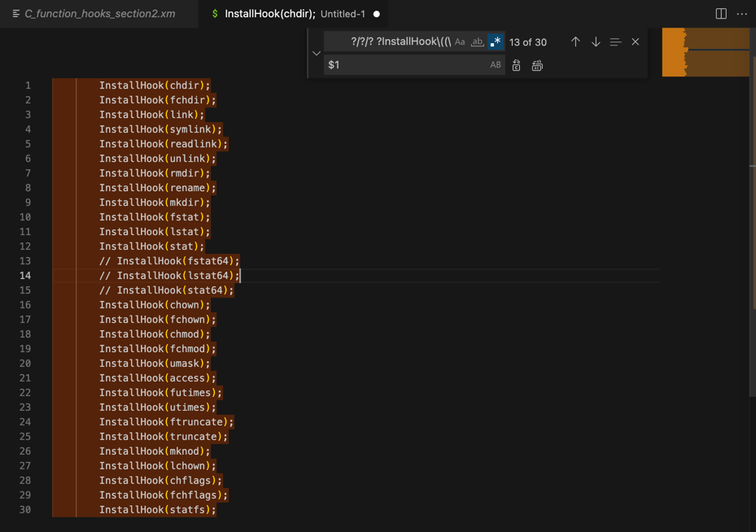
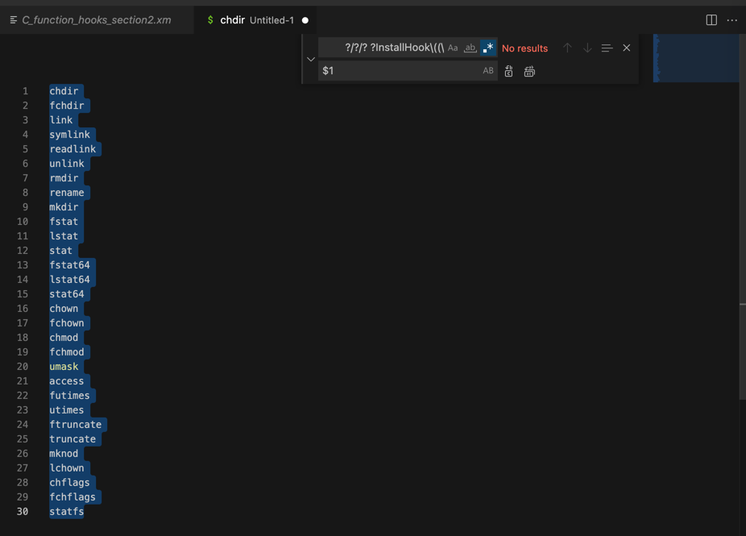

# 只保留InstallHook中的函数名

正则：

```bash
        ?/?/? ?InstallHook\((\S+)\);
$1
```

替换前：

```c
     InstallHook(chdir);
        InstallHook(fchdir);
        InstallHook(link);
        InstallHook(symlink);
        InstallHook(readlink);
        InstallHook(unlink);
        InstallHook(rmdir);
        InstallHook(rename);
        InstallHook(mkdir);
        InstallHook(fstat);
        InstallHook(lstat);
        InstallHook(stat);
        // InstallHook(fstat64);
        // InstallHook(lstat64);
        // InstallHook(stat64);
        InstallHook(chown);
        InstallHook(fchown);
        InstallHook(chmod);
        InstallHook(fchmod);
        InstallHook(umask);
        InstallHook(access);
        InstallHook(futimes);
        InstallHook(utimes);
        InstallHook(ftruncate);
        InstallHook(truncate);
        InstallHook(mknod);
        InstallHook(lchown);
        InstallHook(chflags);
        InstallHook(fchflags);
        InstallHook(statfs);
```



替换后：

```c
chdir
fchdir
link
symlink
readlink
unlink
rmdir
rename
mkdir
fstat
lstat
stat
fstat64
lstat64
stat64
chown
fchown
chmod
fchmod
umask
access
futimes
utimes
ftruncate
truncate
mknod
lchown
chflags
fchflags
statfs
```


