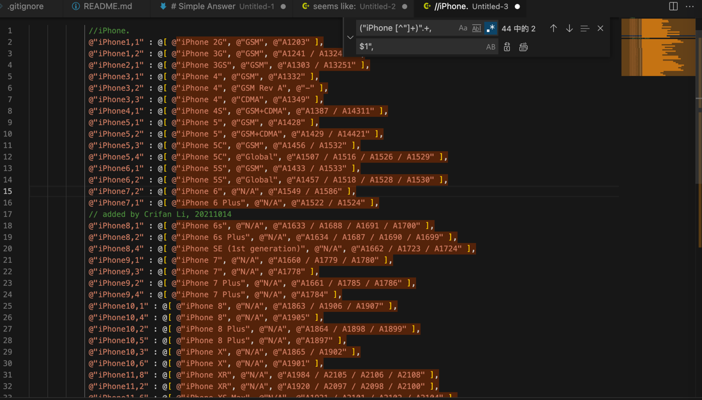
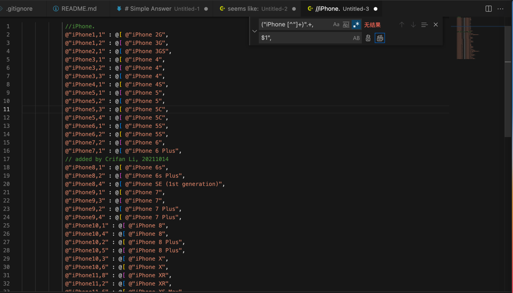
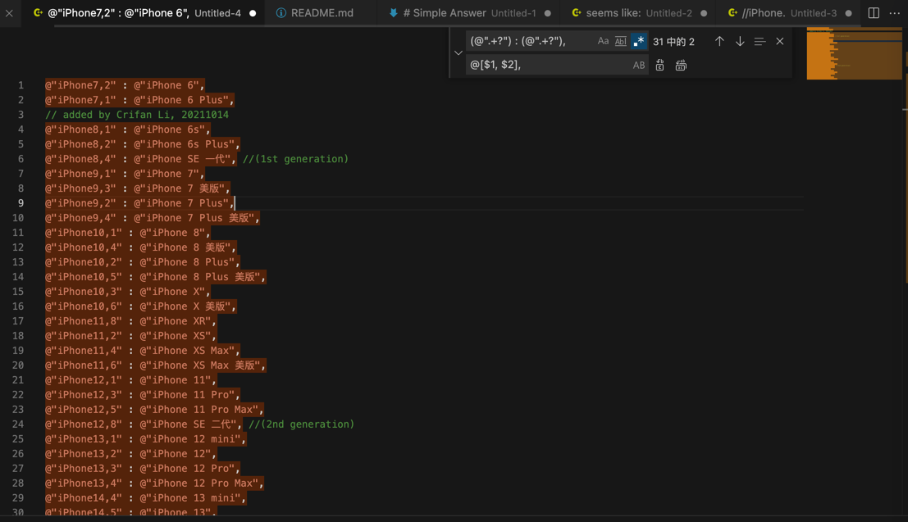
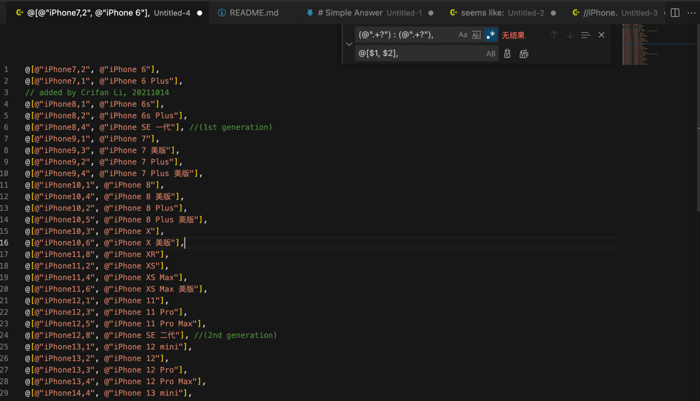

# 去除iPhone机型中后面的部分

## 第一步

正则：

```bash
("iPhone [^"]+)".+,
$1",
```

替换前：

```c
             //iPhone.
             @"iPhone1,1" : @[ @"iPhone 2G", @"GSM", @"A1203" ],
             @"iPhone1,2" : @[ @"iPhone 3G", @"GSM", @"A1241 / A13241" ],
             @"iPhone2,1" : @[ @"iPhone 3GS", @"GSM", @"A1303 / A13251" ],
             @"iPhone3,1" : @[ @"iPhone 4", @"GSM", @"A1332" ],
             @"iPhone3,2" : @[ @"iPhone 4", @"GSM Rev A", @"-" ],
             @"iPhone3,3" : @[ @"iPhone 4", @"CDMA", @"A1349" ],
             @"iPhone4,1" : @[ @"iPhone 4S", @"GSM+CDMA", @"A1387 / A14311" ],
             @"iPhone5,1" : @[ @"iPhone 5", @"GSM", @"A1428" ],
             @"iPhone5,2" : @[ @"iPhone 5", @"GSM+CDMA", @"A1429 / A14421" ],
             @"iPhone5,3" : @[ @"iPhone 5C", @"GSM", @"A1456 / A1532" ],
             @"iPhone5,4" : @[ @"iPhone 5C", @"Global", @"A1507 / A1516 / A1526 / A1529" ],
             @"iPhone6,1" : @[ @"iPhone 5S", @"GSM", @"A1433 / A1533" ],
             @"iPhone6,2" : @[ @"iPhone 5S", @"Global", @"A1457 / A1518 / A1528 / A1530" ],
             @"iPhone7,2" : @[ @"iPhone 6", @"N/A", @"A1549 / A1586" ],
             @"iPhone7,1" : @[ @"iPhone 6 Plus", @"N/A", @"A1522 / A1524" ],
             // added by Crifan Li, 20211014
             @"iPhone8,1" : @[ @"iPhone 6s", @"N/A", @"A1633 / A1688 / A1691 / A1700" ],
             @"iPhone8,2" : @[ @"iPhone 6s Plus", @"N/A", @"A1634 / A1687 / A1690 / A1699" ],
             @"iPhone8,4" : @[ @"iPhone SE (1st generation)", @"N/A", @"A1662 / A1723 / A1724" ],
             @"iPhone9,1" : @[ @"iPhone 7", @"N/A", @"A1660 / A1779 / A1780" ],
             @"iPhone9,3" : @[ @"iPhone 7", @"N/A", @"A1778" ],
             @"iPhone9,2" : @[ @"iPhone 7 Plus", @"N/A", @"A1661 / A1785 / A1786" ],
             @"iPhone9,4" : @[ @"iPhone 7 Plus", @"N/A", @"A1784" ],
             @"iPhone10,1" : @[ @"iPhone 8", @"N/A", @"A1863 / A1906 / A1907" ],
             @"iPhone10,4" : @[ @"iPhone 8", @"N/A", @"A1905" ],
             @"iPhone10,2" : @[ @"iPhone 8 Plus", @"N/A", @"A1864 / A1898 / A1899" ],
             @"iPhone10,5" : @[ @"iPhone 8 Plus", @"N/A", @"A1897" ],
             @"iPhone10,3" : @[ @"iPhone X", @"N/A", @"A1865 / A1902" ],
             @"iPhone10,6" : @[ @"iPhone X", @"N/A", @"A1901" ],
             @"iPhone11,8" : @[ @"iPhone XR", @"N/A", @"A1984 / A2105 / A2106 / A2108" ],
             @"iPhone11,2" : @[ @"iPhone XR", @"N/A", @"A1920 / A2097 / A2098 / A2100" ],
             @"iPhone11,6" : @[ @"iPhone XS Max", @"N/A", @"A1921 / A2101 / A2102 / A2104" ],
             @"iPhone11,4" : @[ @"iPhone XS Max", @"N/A", @"?" ],
             @"iPhone12,1" : @[ @"iPhone 11", @"N/A", @"A2111 / A2221 / A2223" ],
             @"iPhone12,3" : @[ @"iPhone 11 Pro", @"N/A", @"A2160 / A2215 / A2217" ],
             @"iPhone12,5" : @[ @"iPhone 11 Pro Max", @"N/A", @"A2161 / A2220 / A2218" ],
             @"iPhone12,8" : @[ @"iPhone SE (2nd generation)", @"N/A", @"A2275 / A2296 / A2298" ],
             @"iPhone13,1" : @[ @"iPhone 12 mini", @"N/A", @"A2176 / A2398 / A2400 / A2399" ],
             @"iPhone13,2" : @[ @"iPhone 12", @"N/A", @"A2172 / A2402 / A2404 / A2403" ],
             @"iPhone13,3" : @[ @"iPhone 12 Pro", @"N/A", @"A2341 / A2406 / A2407 / A2408" ],
             @"iPhone13,4" : @[ @"iPhone 12 Pro Max", @"N/A", @"A2342 / A2410 / A2411 / A2412" ],
             @"iPhone14,4" : @[ @"iPhone 13 mini", @"N/A", @"?" ],
             @"iPhone14,5" : @[ @"iPhone 13", @"N/A", @"?" ],
             @"iPhone14,2" : @[ @"iPhone 13 Pro", @"N/A", @"?" ],
             @"iPhone14,3" : @[ @"iPhone 13 Pro Max", @"N/A", @"?" ],
```



替换后：

```c
             //iPhone.
             @"iPhone1,1" : @[ @"iPhone 2G",
             @"iPhone1,2" : @[ @"iPhone 3G",
             @"iPhone2,1" : @[ @"iPhone 3GS",
             @"iPhone3,1" : @[ @"iPhone 4",
             @"iPhone3,2" : @[ @"iPhone 4",
             @"iPhone3,3" : @[ @"iPhone 4",
             @"iPhone4,1" : @[ @"iPhone 4S",
             @"iPhone5,1" : @[ @"iPhone 5",
             @"iPhone5,2" : @[ @"iPhone 5",
             @"iPhone5,3" : @[ @"iPhone 5C",
             @"iPhone5,4" : @[ @"iPhone 5C",
             @"iPhone6,1" : @[ @"iPhone 5S",
             @"iPhone6,2" : @[ @"iPhone 5S",
             @"iPhone7,2" : @[ @"iPhone 6",
             @"iPhone7,1" : @[ @"iPhone 6 Plus",
             // added by Crifan Li, 20211014
             @"iPhone8,1" : @[ @"iPhone 6s",
             @"iPhone8,2" : @[ @"iPhone 6s Plus",
             @"iPhone8,4" : @[ @"iPhone SE (1st generation)",
             @"iPhone9,1" : @[ @"iPhone 7",
             @"iPhone9,3" : @[ @"iPhone 7",
             @"iPhone9,2" : @[ @"iPhone 7 Plus",
             @"iPhone9,4" : @[ @"iPhone 7 Plus",
             @"iPhone10,1" : @[ @"iPhone 8",
             @"iPhone10,4" : @[ @"iPhone 8",
             @"iPhone10,2" : @[ @"iPhone 8 Plus",
             @"iPhone10,5" : @[ @"iPhone 8 Plus",
             @"iPhone10,3" : @[ @"iPhone X",
             @"iPhone10,6" : @[ @"iPhone X",
             @"iPhone11,8" : @[ @"iPhone XR",
             @"iPhone11,2" : @[ @"iPhone XR",
             @"iPhone11,6" : @[ @"iPhone XS Max",
             @"iPhone11,4" : @[ @"iPhone XS Max",
             @"iPhone12,1" : @[ @"iPhone 11",
             @"iPhone12,3" : @[ @"iPhone 11 Pro",
             @"iPhone12,5" : @[ @"iPhone 11 Pro Max",
             @"iPhone12,8" : @[ @"iPhone SE (2nd generation)",
             @"iPhone13,1" : @[ @"iPhone 12 mini",
             @"iPhone13,2" : @[ @"iPhone 12",
             @"iPhone13,3" : @[ @"iPhone 12 Pro",
             @"iPhone13,4" : @[ @"iPhone 12 Pro Max",
             @"iPhone14,4" : @[ @"iPhone 13 mini",
             @"iPhone14,5" : @[ @"iPhone 13",
             @"iPhone14,2" : @[ @"iPhone 13 Pro",
             @"iPhone14,3" : @[ @"iPhone 13 Pro Max",
```



## 第二步

继续类似的：

把dict转list

正则：

```bash
(@".+?") : (@".+?”),
@[$1, $2],
```

替换前：

```c
@"iPhone7,2" : @"iPhone 6",
@"iPhone7,1" : @"iPhone 6 Plus",
// added by Crifan Li, 20211014
@"iPhone8,1" : @"iPhone 6s",
@"iPhone8,2" : @"iPhone 6s Plus",
@"iPhone8,4" : @"iPhone SE 一代", //(1st generation)
@"iPhone9,1" : @"iPhone 7",
@"iPhone9,3" : @"iPhone 7 美版",
@"iPhone9,2" : @"iPhone 7 Plus",
@"iPhone9,4" : @"iPhone 7 Plus 美版",
@"iPhone10,1" : @"iPhone 8",
@"iPhone10,4" : @"iPhone 8 美版",
@"iPhone10,2" : @"iPhone 8 Plus",
@"iPhone10,5" : @"iPhone 8 Plus 美版",
@"iPhone10,3" : @"iPhone X",
@"iPhone10,6" : @"iPhone X 美版",
@"iPhone11,8" : @"iPhone XR",
@"iPhone11,2" : @"iPhone XS",
@"iPhone11,4" : @"iPhone XS Max",
@"iPhone11,6" : @"iPhone XS Max 美版",
@"iPhone12,1" : @"iPhone 11",
@"iPhone12,3" : @"iPhone 11 Pro",
@"iPhone12,5" : @"iPhone 11 Pro Max",
@"iPhone12,8" : @"iPhone SE 二代", //(2nd generation)
@"iPhone13,1" : @"iPhone 12 mini",
@"iPhone13,2" : @"iPhone 12",
@"iPhone13,3" : @"iPhone 12 Pro",
@"iPhone13,4" : @"iPhone 12 Pro Max",
@"iPhone14,4" : @"iPhone 13 mini",
@"iPhone14,5" : @"iPhone 13",
@"iPhone14,2" : @"iPhone 13 Pro",
@"iPhone14,3" : @"iPhone 13 Pro Max",
```



替换后：

```c
@[@"iPhone7,2", @"iPhone 6"],
@[@"iPhone7,1", @"iPhone 6 Plus"],
// added by Crifan Li, 20211014
@[@"iPhone8,1", @"iPhone 6s"],
@[@"iPhone8,2", @"iPhone 6s Plus"],
@[@"iPhone8,4", @"iPhone SE 一代"], //(1st generation)
@[@"iPhone9,1", @"iPhone 7"],
@[@"iPhone9,3", @"iPhone 7 美版"],
@[@"iPhone9,2", @"iPhone 7 Plus"],
@[@"iPhone9,4", @"iPhone 7 Plus 美版"],
@[@"iPhone10,1", @"iPhone 8"],
@[@"iPhone10,4", @"iPhone 8 美版"],
@[@"iPhone10,2", @"iPhone 8 Plus"],
@[@"iPhone10,5", @"iPhone 8 Plus 美版"],
@[@"iPhone10,3", @"iPhone X"],
@[@"iPhone10,6", @"iPhone X 美版"],
@[@"iPhone11,8", @"iPhone XR"],
@[@"iPhone11,2", @"iPhone XS"],
@[@"iPhone11,4", @"iPhone XS Max"],
@[@"iPhone11,6", @"iPhone XS Max 美版"],
@[@"iPhone12,1", @"iPhone 11"],
@[@"iPhone12,3", @"iPhone 11 Pro"],
@[@"iPhone12,5", @"iPhone 11 Pro Max"],
@[@"iPhone12,8", @"iPhone SE 二代"], //(2nd generation)
@[@"iPhone13,1", @"iPhone 12 mini"],
@[@"iPhone13,2", @"iPhone 12"],
@[@"iPhone13,3", @"iPhone 12 Pro"],
@[@"iPhone13,4", @"iPhone 12 Pro Max"],
@[@"iPhone14,4", @"iPhone 13 mini"],
@[@"iPhone14,5", @"iPhone 13"],
@[@"iPhone14,2", @"iPhone 13 Pro"],
@[@"iPhone14,3", @"iPhone 13 Pro Max"],
```



用于后续写代码的机型定义中
