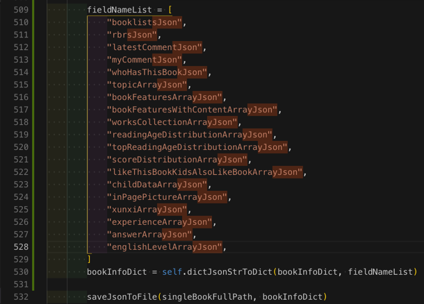

# json后缀的字符串变成代码中字符串列表

正则：

```bash
(\w+)\n
  "$1",\n
```

从：

```bash
booklistsJson
rbrsJson
latestCommentJson
myCommentJson
whoHasThisBookJson
topicArrayJson
bookFeaturesArrayJson
bookFeaturesWithContentArrayJson
worksCollectionArrayJson
readingAgeDistributionArrayJson
topReadingAgeDistributionArrayJson
scoreDistributionArrayJson
likeThisBookKidsAlsoLikeBookArrayJson
childDataArrayJson
inPagePictureArrayJson
xunxiArrayJson
experienceArrayJson
answerArrayJson
englishLevelArrayJson

```


变成：

```bash
  "booklistsJson",
  "rbrsJson",
  "latestCommentJson",
  "myCommentJson",
  "whoHasThisBookJson",
  "topicArrayJson",
  "bookFeaturesArrayJson",
  "bookFeaturesWithContentArrayJson",
  "worksCollectionArrayJson",
  "readingAgeDistributionArrayJson",
  "topReadingAgeDistributionArrayJson",
  "scoreDistributionArrayJson",
  "likeThisBookKidsAlsoLikeBookArrayJson",
  "childDataArrayJson",
  "inPagePictureArrayJson",
  "xunxiArrayJson",
  "experienceArrayJson",
  "answerArrayJson",
  "englishLevelArrayJson",
```


用于：

拷贝到代码里，用于列表变量的值：



省去：自己手动去对每一行手动去加上`""`再控制`缩进`的繁琐工作了。
