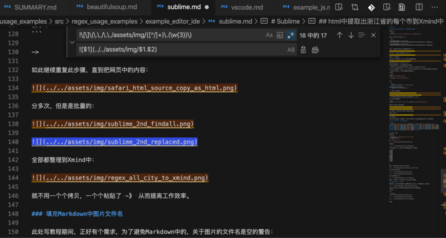

# 填充Markdown中图片文件名

此处正在写教程期间，正好有个需求：为了避免和消除Markdown中的，关于图片的文件名即image的alt的text是空的警告：


然后正好用正则，去自动填充此处image的alt的text，即图片的文件名

用正则：

```bash
!\[\]\(\.\./\.\./assets/img/([^/]+)\.(\w{3})\)

```

把：

```bash


```



变成：

```bash


```


即可自动填充image的alt的text，消除Markdown中的警告了。
