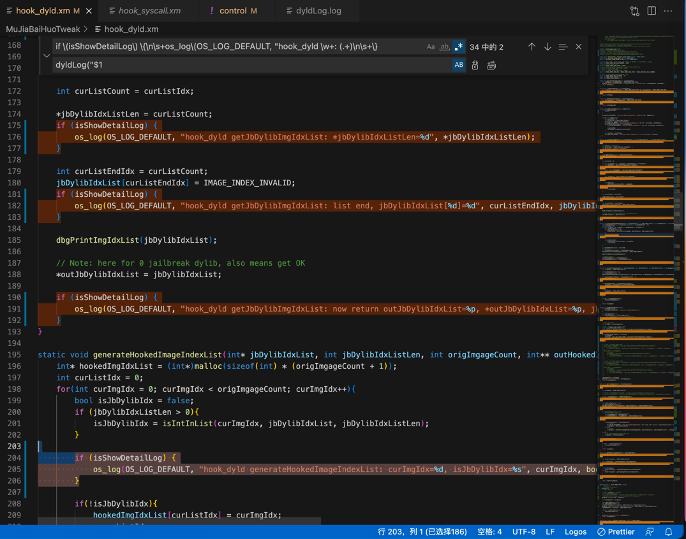
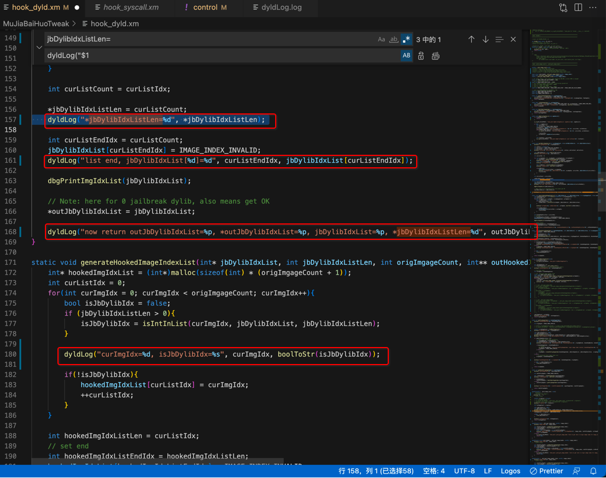

# 把os_log换成自己定义的宏dylibLog

正则：

```bash
if \(isShowDetailLog\) \{\n\s+os_log\(OS_LOG_DEFAULT, "hook_dyld \w+: (.+)\n\s+\}

dyldLog("$1
```

替换前：

```c
    if (isShowDetailLog) {
        os_log(OS_LOG_DEFAULT, "hook_dyld getJbDylibImgIdxList: *jbDylibIdxListLen=%d", *jbDylibIdxListLen);
    }

    if (isShowDetailLog) {
        os_log(OS_LOG_DEFAULT, "hook_dyld getJbDylibImgIdxList: list end, jbDylibIdxList[%d]=%d", curListEndIdx, jbDylibIdxList[curListEndIdx]);
    }

    if (isShowDetailLog) {
        os_log(OS_LOG_DEFAULT, "hook_dyld getJbDylibImgIdxList: now return outJbDylibIdxList=%p, *outJbDylibIdxList=%p, jbDylibIdxList=%p, *jbDylibIdxListLen=%d", outJbDylibIdxList, *outJbDylibIdxList, jbDylibIdxList, *jbDylibIdxListLen);
    }


        if (isShowDetailLog) {
            os_log(OS_LOG_DEFAULT, "hook_dyld generateHookedImageIndexList: curImgIdx=%d, isJbDylibIdx=%s", curImgIdx, boolToStr(isJbDylibIdx));
        }
```



替换后：

```c
    dyldLog("*jbDylibIdxListLen=%d", *jbDylibIdxListLen);

    dyldLog("list end, jbDylibIdxList[%d]=%d", curListEndIdx, jbDylibIdxList[curListEndIdx]);

    dyldLog("now return outJbDylibIdxList=%p, *outJbDylibIdxList=%p, jbDylibIdxList=%p, *jbDylibIdxListLen=%d", outJbDylibIdxList, *outJbDylibIdxList, jbDylibIdxList, *jbDylibIdxListLen);

        dyldLog("curImgIdx=%d, isJbDylibIdx=%s", curImgIdx, boolToStr(isJbDylibIdx));
```



实现了，这个函数的参数部分，整体的替换。
