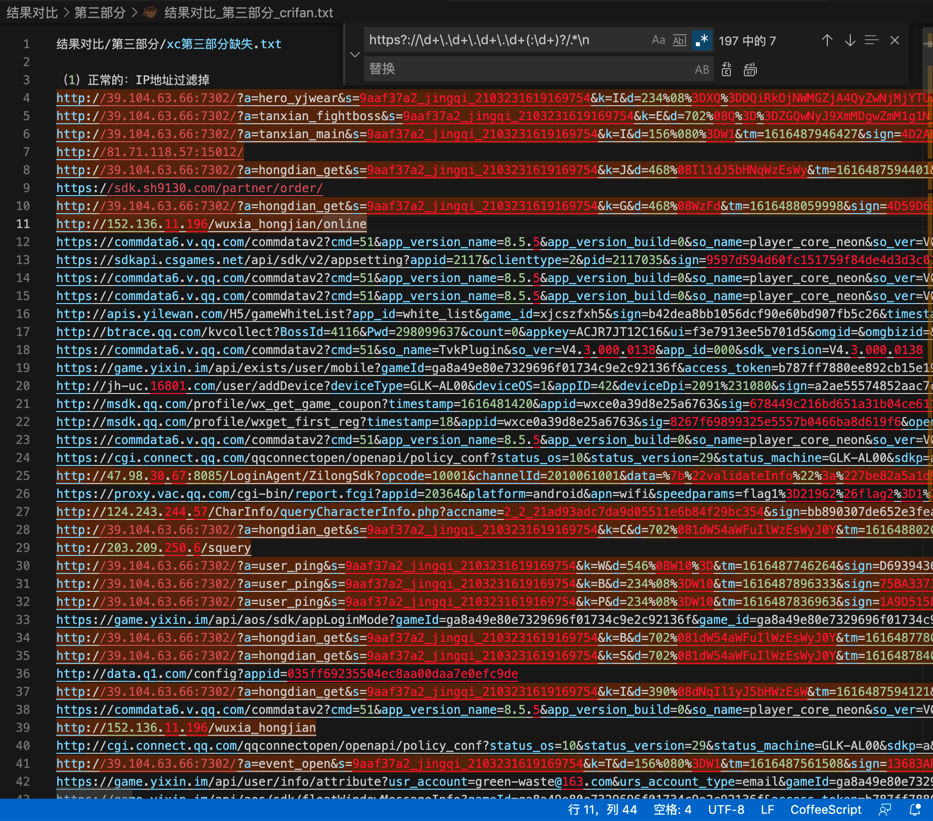
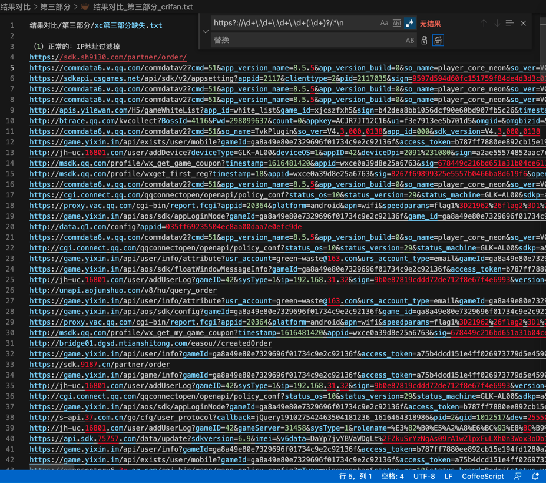

# 去除IP地址的行

正则：

```bash
https?://\d+\.\d+\.\d+\.\d+(:\d+)?/.*\n

```

替换前：

```bash
http://81.71.118.57:15012/
http://39.104.63.66:7302/?a=hongdian_get&s=9aaf37a2_jingqi_2103231619169754&k=J&d=468%08Il1dJ5bHNqWzEsWy&tm=1616487594401&sign=FB47FD0DF30329F441D863E0C3287ADA
https://sdk.sh9130.com/partner/order/
http://39.104.63.66:7302/?a=hongdian_get&s=9aaf37a2_jingqi_2103231619169754&k=G&d=468%08WzFd&tm=1616488059998&sign=4D59D639DF1F78672AEE5F5DD28D372A
http://152.136.11.196/wuxia_hongjian/online
...
```



变成：

```bash
https://sdk.sh9130.com/partner/order/
...
```



便于分析抓包中，非IP地址的链接内容。
