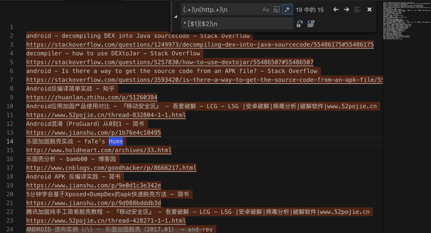

# 其他小的例子

此处整理其他相对小的零碎的例子供参考。

## 把print换成logging.debug

用：

```bash
print\("([^"]+)"(\s*%\s*\(?([^\)]+)\)?)?\)
logging.debug("$1", $3)
```

把：

print没有参数的：

```python
print("taped 通讯录")
```

print单个参数的

```python
print("++++++++++ taped element: %s" % curElement)
```

print多个参数的：

```python
print("++++++++++ clicked element position: %s,%s" % (centerX, centerY))
print("Cost time %.2fs for save source %s" % (saveSourceTime, savedSourceFile))
```

都一次性变成logging.debug的写法：

```python
      logging.debug("++++++++++ taped element: %s", curElement)

      logging.debug("++++++++++ clicked element position: %s,%s", centerX, centerY)

    logging.debug("Cost time %.2fs for save source %s", saveSourceTime, savedSourceFile)

    logging.debug("taped 通讯录", )
```

## 去除内容中多余的 lessionxxx的单词

正则：

```bash
lesson\s*\d+\n

```

从：


替换成：


### 语句末尾去掉感叹号

正则：

```bash
!\n
\n
```

从：


替换成：


## 文章标题和链接转换为Markdown的链接

正则替换规则：

```bash
(.+)\n(http.+)\n
* [$1]($2)\n
```

从：

```bash
android - decompiling DEX into Java sourcecode - Stack Overflow
https://stackoverflow.com/questions/1249973/decompiling-dex-into-java-sourcecode/55486175#55486175
decompiler - how to use DEXtoJar - Stack Overflow
https://stackoverflow.com/questions/5257830/how-to-use-dextojar/55486507#55486507
android - Is there a way to get the source code from an APK file? - Stack Overflow
https://stackoverflow.com/questions/3593420/is-there-a-way-to-get-the-source-code-from-an-apk-file/55567538#55567538
Android反编译简单实战 - 知乎
https://zhuanlan.zhihu.com/p/51260384
Android应用加固产品使用对比 - 『移动安全区』 - 吾爱破解 - LCG - LSG |安卓破解|病毒分析|破解软件|www.52pojie.cn
https://www.52pojie.cn/thread-832804-1-1.html
Android混淆（ProGuard）从0到1 - 简书
https://www.jianshu.com/p/1b76e4c10495
乐固加固脱壳实战 - faTe's Home
http://www.holdheart.com/archives/33.html
乐固壳分析 - bamb00 - 博客园
http://www.cnblogs.com/goodhacker/p/8666217.html
Android APK 反编译实践 - 简书
https://www.jianshu.com/p/9e0d1c3e342e
5分钟学会基于Xposed+DumpDex的apk快速脱壳方法 - 简书
https://www.jianshu.com/p/9d988bdddb3d
腾讯加固纯手工简易脱壳教程 - 『移动安全区』 - 吾爱破解 - LCG - LSG |安卓破解|病毒分析|破解软件|www.52pojie.cn
https://www.52pojie.cn/thread-428271-1-1.html
ANDROID 逆向实例（八）－ 乐固加固脱壳（2017.01） ~ and-rev
https://and-rev.blogspot.com/2017/05/android-201701.html
花生日记APP邀请注册机实战（360加固脱壳） – Silkage's Blog
https://blog.silkage.net/software/peanutdiary.html
如何反编译Android 的apk/dex/odex，获得源码 – 码农日记
https://www.androiddev.net/反编译android-的apk/
HangZhouCat/ReaverAPKTools: 逆向APK工具
https://github.com/HangZhouCat/ReaverAPKTools
Android逆向之路---脱壳360加固 - 简书
https://www.jianshu.com/p/d24c6694fe97
26款优秀的Android逆向工程工具 - 简书
https://www.jianshu.com/p/ef0b6f75c229
Application Hardening - Mobile App Hardening | Promon
https://promon.co/security-news/application-hardening/
Cydia Substrate使用手册 - 简书
https://www.jianshu.com/p/ba795ff3471a
```

把：



换成：

```markdown
* [android - decompiling DEX into Java sourcecode - Stack Overflow](https://stackoverflow.com/questions/1249973/decompiling-dex-into-java-sourcecode/55486175#55486175)
* [decompiler - how to use DEXtoJar - Stack Overflow](https://stackoverflow.com/questions/5257830/how-to-use-dextojar/55486507#55486507)
* [android - Is there a way to get the source code from an APK file? - Stack Overflow](https://stackoverflow.com/questions/3593420/is-there-a-way-to-get-the-source-code-from-an-apk-file/55567538#55567538)
* [Android反编译简单实战 - 知乎](https://zhuanlan.zhihu.com/p/51260384)
* [Android应用加固产品使用对比 - 『移动安全区』 - 吾爱破解 - LCG - LSG |安卓破解|病毒分析|破解软件|www.52pojie.cn](https://www.52pojie.cn/thread-832804-1-1.html)
* [Android混淆（ProGuard）从0到1 - 简书](https://www.jianshu.com/p/1b76e4c10495)
* [乐固加固脱壳实战 - faTe's Home](http://www.holdheart.com/archives/33.html)
* [乐固壳分析 - bamb00 - 博客园](http://www.cnblogs.com/goodhacker/p/8666217.html)
* [Android APK 反编译实践 - 简书](https://www.jianshu.com/p/9e0d1c3e342e)
* [5分钟学会基于Xposed+DumpDex的apk快速脱壳方法 - 简书](https://www.jianshu.com/p/9d988bdddb3d)
* [腾讯加固纯手工简易脱壳教程 - 『移动安全区』 - 吾爱破解 - LCG - LSG |安卓破解|病毒分析|破解软件|www.52pojie.cn](https://www.52pojie.cn/thread-428271-1-1.html)
* [ANDROID 逆向实例（八）－ 乐固加固脱壳（2017.01） ~ and-rev](https://and-rev.blogspot.com/2017/05/android-201701.html)
* [花生日记APP邀请注册机实战（360加固脱壳） – Silkage's Blog](https://blog.silkage.net/software/peanutdiary.html)
* [如何反编译Android 的apk/dex/odex，获得源码 – 码农日记](https://www.androiddev.net/反编译android-的apk/)
* [HangZhouCat/ReaverAPKTools: 逆向APK工具](https://github.com/HangZhouCat/ReaverAPKTools)
* [Android逆向之路---脱壳360加固 - 简书](https://www.jianshu.com/p/d24c6694fe97)
* [26款优秀的Android逆向工程工具 - 简书](https://www.jianshu.com/p/ef0b6f75c229)
* [Application Hardening - Mobile App Hardening | Promon](https://promon.co/security-news/application-hardening/)
* [Cydia Substrate使用手册 - 简书](https://www.jianshu.com/p/ba795ff3471a)
```


用于：放在`markdown`作为参考资料。

## json后缀的字符串变成代码中字符串列表

正则：

```bash
(\w+)\n
  "$1",\n
```

从：

```bash
booklistsJson
rbrsJson
latestCommentJson
myCommentJson
whoHasThisBookJson
topicArrayJson
bookFeaturesArrayJson
bookFeaturesWithContentArrayJson
worksCollectionArrayJson
readingAgeDistributionArrayJson
topReadingAgeDistributionArrayJson
scoreDistributionArrayJson
likeThisBookKidsAlsoLikeBookArrayJson
childDataArrayJson
inPagePictureArrayJson
xunxiArrayJson
experienceArrayJson
answerArrayJson
englishLevelArrayJson

```


变成：

```bash
  "booklistsJson",
  "rbrsJson",
  "latestCommentJson",
  "myCommentJson",
  "whoHasThisBookJson",
  "topicArrayJson",
  "bookFeaturesArrayJson",
  "bookFeaturesWithContentArrayJson",
  "worksCollectionArrayJson",
  "readingAgeDistributionArrayJson",
  "topReadingAgeDistributionArrayJson",
  "scoreDistributionArrayJson",
  "likeThisBookKidsAlsoLikeBookArrayJson",
  "childDataArrayJson",
  "inPagePictureArrayJson",
  "xunxiArrayJson",
  "experienceArrayJson",
  "answerArrayJson",
  "englishLevelArrayJson",
```


用于：

拷贝到代码里，用于列表变量的值：


省去：自己手动去对每一行手动去加上`""`再控制`缩进`的繁琐工作了。

## 获取到康美通的版本历史

正则：

```bash
(\.\d+)\n
$1 
```

从：

```bash
相关历史版本


23.34MB最新版
康美通 4.3.0
23.34MB 安全下载
康美通 4.2.3
19.47MB 安全下载
康美通 4.2.2
19.29MB 安全下载
康美通 4.2.1
19.29MB 安全下载
康美通 4.2.0
19.18MB 安全下载
康美通 4.1.1
19.47MB 安全下载
康美通 4.1.0
19.48MB 安全下载
康美通 4.0
14.37MB 安全下载
康美通 3.2
14.22MB 安全下载
康美通 3.1
23.2MB 安全下载
康美通 3.0
23.1MB 安全下载
康美通 2.0.9
7.93MB 安全下载
康美通 2.0.8
7.3MB 安全下载
康美通 2.0.7
7.29MB 安全下载
康美通 2.0.6
7.29MB 安全下载
康美通 1.0.1
6.27MB 安全下载
康美通 1.0beta
5.86MB 安全下载
 下载豌豆荚客户端 (更多历史版本)下载
康美通 历史版本年份合集
```


替换成：

```bash
相关历史版本

23.34MB最新版
康美通 4.3.0 23.34MB 安全下载
康美通 4.2.3 19.47MB 安全下载
康美通 4.2.2 19.29MB 安全下载
康美通 4.2.1 19.29MB 安全下载
康美通 4.2.0 19.18MB 安全下载
康美通 4.1.1 19.47MB 安全下载
康美通 4.1.0 19.48MB 安全下载
康美通 4.0 14.37MB 安全下载
康美通 3.2 14.22MB 安全下载
康美通 3.1 23.2MB 安全下载
康美通 3.0 23.1MB 安全下载
康美通 2.0.9 7.93MB 安全下载
康美通 2.0.8 7.3MB 安全下载
康美通 2.0.7 7.29MB 安全下载
康美通 2.0.6 7.29MB 安全下载
康美通 1.0.1 6.27MB 安全下载
康美通 1.0beta
5.86MB 安全下载
 下载豌豆荚客户端 (更多历史版本)下载
康美通 历史版本年份合集
```


再去用正则：

```bash
 安全下载

```

替换，得到我们要的：

```bash
相关历史版本：
康美通 4.3.1 23.34MB
康美通 4.3.0 23.34MB
康美通 4.2.3 19.47MB
康美通 4.2.2 19.29MB
康美通 4.2.1 19.29MB
康美通 4.2.0 19.18MB
康美通 4.1.1 19.47MB
康美通 4.1.0 19.48MB
康美通 4.0 14.37MB
康美通 3.2 14.22MB
康美通 3.1 23.2MB
康美通 3.0 23.1MB
康美通 2.0.9 7.93MB
康美通 2.0.8 7.3MB
康美通 2.0.7 7.29MB
康美通 2.0.6 7.29MB
康美通 1.0.1 6.27MB
康美通 1.0beta 5.86MB
```

## 去掉srt字幕中font size

正则：

```bash
<font size="36">([^<>/]+)</font>
$1
```

从：


替换成：


## 去除掉csv中多余的`="xxx"`

客户给的一个数据文件csv格式的，但是内部内容中发现有多余的 `="xxx"`，应该改为`xxx`才对。

所以用VSCode去替换，用正则：

```bash
="(.+?)”
$1
```

实现了，把 `="7xxx1"`：


替换成 `7xxx1`：


即可。

## 给文章段落增加换行

用正则：

```bash
\n(\d.)
\n\n$1
```

把：

```bash
...互。
1.字节跳动
...说过。
2.陆奇给年轻人的话
...
8.网易 丁磊
...
```


变成：

```bash
...互。
1.字节跳动
...说过。

2.陆奇给年轻人的话
...

8.网易 丁磊
...
```


## 把url中查询参数换成代码中字典参数

用正则：

```bash
dt=([^&]+)&?
"dt": "$1",\n
```

把：

```bash
dt=at&dt=bd&dt=ex&dt=ld&dt=md&dt=qca&dt=rw&dt=rm&dt=ss&dt=t
```


替换成：

```bash
"dt": "at",
"dt": "bd",
"dt": "ex",
"dt": "ld",
"dt": "md",
"dt": "qca",
"dt": "rw",
"dt": "rm",
"dt": "ss",
"dt": "t",
```


用于后续放到代码中使用：


## 把每个词都加上引号，用于放代码中用

用正则：

```bash
(.+)
    "$1",
```

从输入：

```bash
更新公告
签到奖励
离线经验
在线奖励
等级礼包
资源找回
活动时间
活动内容
累计充值

```


变成：

```bash
    "更新公告",
    "签到奖励",
    "离线经验",
    "在线奖励",
    "等级礼包",
    "资源找回",
    "活动时间",
    "活动内容",
    "累计充值",
```


用于拷贝到代码中使用：


## 去除每行秒及毫秒的多余换行

正则：

```bash
\n((\d+ s )?\d+ ms)
$1
```

从：

```bash
completed successfully 
3 s 149 ms 
Run build 
3 s 80 ms 
Load build 
2 ms 
Evaluate settings 
1 ms 
Finalize build cache configuration 


Configure build 
420 ms 
Load projects 
6 ms 
Calculate task graph 
120 ms 
Run tasks 
2 s 532 ms 
:api:preBuild 
21 ms 
:api:preDebugBuild 
3 ms 
:api:compileDebugAidl 
1 s 95 ms 
Execute taskAction 
869 ms 
:cts_provider:preBuild 

。。。
```

变成：

```bash
completed successfully 3 s 149 ms 
Run build 3 s 80 ms 
Load build 2 ms 
Evaluate settings 1 ms 
Finalize build cache configuration 


Configure build 420 ms 
Load projects 6 ms 
Calculate task graph 120 ms 
Run tasks 2 s 532 ms 
:api:preBuild 21 ms 
:api:preDebugBuild 3 ms 
:api:compileDebugAidl 1 s 95 ms 
Execute taskAction 869 ms 
:cts_provider:preBuild 
。。。
```

即可实现：

去掉了每行多余的换行

## Markdown中让EF后缀变下标且加粗

正则：

```bash
`EF([^`]+)`
EF<b><sub>$1</sub></b>
```

从：

```markdown
    * EF<b><sub>IMPI</sub></b> – IMS private user identity,
    * EF<b><sub>DOMAIN</sub></b> - Home Network Domain Name,
    * `EFIMPU` - IMS Public User Identity (one or more),
    * `EFAD` - Administrative Data (UE operation mode, e.g. normal or type approval),
    * `EFARR` - Access Rule Reference (access rules for files located under the ISIM ADF),
    * `EFIST` - ISIM Service Table (lists available optional services:P-CSCF address, Generic Bootstrapping Architecture (GBA), HTTP Digest, GBA-based Local Key Establishment Mechanism, support of P-CSCF discovery for IMS local break out),
    * `EFP-CSCF` - P-CSCF Address (one or more),
    * `EFGBABP` - GBA Bootstrapping parameters (contains the AKA Random challenge (RAND) and Bootstrapping Transaction Identifier (B-TID) associate with a GBA bootstrapping procedure),
    * `EFGBANL` - GBA NAF List (contains the list of NAF_ID and B-TID associated to a GBA NAF derivation procedure)
    * `EFNAFKCA` - NAF Key Centre Address (one or more).
```

变成：

```markdown
    * EF<b><sub>IMPI</sub></b> – IMS private user identity,
    * EF<b><sub>DOMAIN</sub></b> - Home Network Domain Name,
    * EF<b><sub>IMPU</sub></b> - IMS Public User Identity (one or more),
    * EF<b><sub>AD</sub></b> - Administrative Data (UE operation mode, e.g. normal or type approval),
    * EF<b><sub>ARR</sub></b> - Access Rule Reference (access rules for files located under the ISIM ADF),
    * EF<b><sub>IST</sub></b> - ISIM Service Table (lists available optional services:P-CSCF address, Generic Bootstrapping Architecture (GBA), HTTP Digest, GBA-based Local Key Establishment Mechanism, support of P-CSCF discovery for IMS local break out),
    * EF<b><sub>P-CSCF</sub></b> - P-CSCF Address (one or more),
    * EF<b><sub>GBABP</sub></b> - GBA Bootstrapping parameters (contains the AKA Random challenge (RAND) and Bootstrapping Transaction Identifier (B-TID) associate with a GBA bootstrapping procedure),
    * EF<b><sub>GBANL</sub></b> - GBA NAF List (contains the list of NAF_ID and B-TID associated to a GBA NAF derivation procedure)
    * EF<b><sub>NAFKCA</sub></b> - NAF Key Centre Address (one or more).
```

Markdown的预览效果：

【此处由于印象笔记冲突导致帖子图片丢失】

## 去掉其他只保留文件名

正则：

```bash
\[.+?\]\t(.+.((jpg)|(png)|(gif)|(pdf))).+\n*
$1\n
```

从：

```bash
[IMG]    主流测试工具分类.jpg    2018-09-21 20:59    159K     
[IMG]    内网渗透.png    2020-02-03 01:25    265K     
[IMG]    域名搜集途径.png    2018-09-21 20:59    139K     
[IMG]    安全漏洞总结.jpg    2018-09-21 20:59    368K     
[IMG]    密码找回逻辑漏洞总结.png    2018-12-18 05:09    141K     
[IMG]    渗透标准.jpg    2020-02-03 01:25    189K     
[IMG]    渗透流程.jpg    2018-09-21 20:59    56K     
[IMG]    渗透测试实验室.jpg    2020-02-03 01:25    888K     
[IMG]    渗透测试思维导图.png    2020-02-03 01:25    3.7M     
[IMG]    渗透测试流程.jpg    2018-09-21 20:59    221K     
[IMG]    渗透测试详细版.jpg    2018-09-21 20:59    260K     
[IMG]    社会工程学.jpg    2018-09-21 20:59    95K     
[IMG]    系统端口审计琐事.jpg    2018-09-21 20:59    57K     
[IMG]    网站入侵图.jpg    2018-09-21 20:59    92K     
[IMG]    网络安全绪论.png    2018-09-21 20:59    678K     
[IMG]    进阶渗透.png    2018-09-21 20:59    103K     
[IMG]    黑客入侵行为分析.gif    2018-09-21 20:59    18K     
[IMG]    JavaWeb简介.png    2018-09-21 20:59    913K     
[IMG]    Jboss引起的内网渗透.png    2018-09-21 20:59    229K     
[IMG]    Maltego使用导图.jpg    2018-09-21 20:59    539K     
[IMG]    Nmap.png    2018-09-21 20:59    1.1M     
[IMG]    PHP源码审计.png    2018-09-21 20:59    4.0M     
[   ]    PTES_MindMap_CN1.pdf    2018-09-21 20:59    417K     
[IMG]    Python系统审计.jpg    2018-09-21 20:59    343K     
[IMG]    RedTeamManula.jpg    2020-02-03 01:25    5.8M     
[IMG]    WEB2HACK.jpg    2020-02-03 01:25    137K     
[IMG]    Web安全技术点.jpg    2018-09-21 20:59    193K     
[IMG]    Web安全.png    2018-09-21 20:59    228K     
[IMG]    Web指纹分析方法.png    2018-09-21 20:59    55K     
[IMG]    Web攻击及防御技术.png    2018-09-21 20:59    855K     
[IMG]    Web服务器入侵防御.jpg    2018-09-21 20:59    88K     
[IMG]    Web 架构中的安全问题.png    2018-09-21 20:59    728K     
[IMG]    Windows常见持久控制.png    2020-02-03 01:25    185K     
[IMG]    XSS利用架构图.jpg    2020-02-03 01:25    100K     
[IMG]    XSS攻击点汇总.png    2018-09-21 20:59    2.2M     
[IMG]    nmap.jpg    2018-09-21 20:59    295K     
[IMG]    pentest_method.jpg    2018-09-21 20:59    177K     
[IMG]    pentester.jpg    2018-09-21 20:59    3.6M     
[IMG]    powershell语法.png    2018-09-21 20:59    323K     
[IMG]    web应用测试.jpg    2020-02-03 01:25    607K     
[IMG]    web渗透.jpg    2018-09-21 20:59    225K     
[IMG]    xml安全汇总.png    2018-09-21 20:59    1.7M     
```

替换为：

```bash
主流测试工具分类.jpg
内网渗透.png
域名搜集途径.png
安全漏洞总结.jpg
密码找回逻辑漏洞总结.png
渗透标准.jpg
渗透流程.jpg
渗透测试实验室.jpg
渗透测试思维导图.png
渗透测试流程.jpg
渗透测试详细版.jpg
社会工程学.jpg
系统端口审计琐事.jpg
网站入侵图.jpg
网络安全绪论.png
进阶渗透.png
黑客入侵行为分析.gif
JavaWeb简介.png
Jboss引起的内网渗透.png
Maltego使用导图.jpg
Nmap.png
PHP源码审计.png
PTES_MindMap_CN1.pdf
Python系统审计.jpg
RedTeamManula.jpg
WEB2HACK.jpg
Web安全技术点.jpg
Web安全.png
Web指纹分析方法.png
Web攻击及防御技术.png
Web服务器入侵防御.jpg
Web 架构中的安全问题.png
Windows常见持久控制.png
XSS利用架构图.jpg
XSS攻击点汇总.png
nmap.jpg
pentest_method.jpg
pentester.jpg
powershell语法.png
web应用测试.jpg
web渗透.jpg
xml安全汇总.png
```

## 搜索get函数被调用的地方

默认如果搜

```bash
get(
```

则会搜出来很多，有很多个 我们不希望看到的

```bash
http.get(
```

想要排斥掉`http.get(`

想到了用正则

参考之前语法：

`(?<!xxx): negative look behind (assertion)=反向否定断言`

去用：

```bash
(?<!http\.)get\(
```

然后只有7个，都是我们要找到了：

【此处由于印象笔记冲突导致帖子图片丢失】

## 想要搜索15秒相关的内容

直接搜15，找到很多`xxx="15"`不是我们要的：

【此处由于印象笔记冲突导致帖子图片丢失】

所以想要排除掉：

* 前面是双引号
* 后面也是双引号的

所以用：

```bash
(?<!")15(?!")
```

即可过滤掉，找到其他地方的15：

【此处由于印象笔记冲突导致帖子图片丢失】

即，支持用

* `look ahead negative`
* `look behind negative`

去过滤掉不要的情况。

## 把链接标题和地址变成Markdown中url格式

用：

```bash
^([^/]+)\n(https?://.+)
* [$1]($2)
```

把：

```bash
PyCharm Community Edition and Professional Edition Explained: Licenses and More | PyCharm Blog
https://blog.jetbrains.com/pycharm/2017/09/pycharm-community-edition-and-professional-edition-explained-licenses-and-more/
Differences between Pycharm community and professional edition?：Python
https://www.reddit.com/r/Python/comments/7370yp/differences_between_pycharm_community_and/
Pycharm的教育版和社区版有什么区别？ - 知乎
https://www.zhihu.com/question/47511825
使用PyCharm进行Python远程调试
http://leoc.leanote.com/post/remote-debugging-with-pycharm
Pycharm的远程代码编辑 - kiwik's blog
http://kiwik.github.io/python/2013/08/12/Pycharm的远程代码编辑/
```

变成markdown中url的格式：

```markdown
* [PyCharm Community Edition and Professional Edition Explained: Licenses and More | PyCharm Blog](https://blog.jetbrains.com/pycharm/2017/09/pycharm-community-edition-and-professional-edition-explained-licenses-and-more/)
* [Differences between Pycharm community and professional edition?：Python](https://www.reddit.com/r/Python/comments/7370yp/differences_between_pycharm_community_and/)
* [Pycharm的教育版和社区版有什么区别？ - 知乎](https://www.zhihu.com/question/47511825)
* [使用PyCharm进行Python远程调试](http://leoc.leanote.com/post/remote-debugging-with-pycharm)
* [Pycharm的远程代码编辑 - kiwik's blog](http://kiwik.github.io/python/2013/08/12/Pycharm的远程代码编辑/)

```

## 单行变多行加换行

想要从 [服务中心_查询保险条款题-条款内容页](http://www.epicc.com.cn/fuwu/chaxunbaoxiantiaokuan/cheliangbaoxian/201505/t20150507_2684.html) 复制出的文字：

```bash
【碰撞】指被保险机动车或其符合装载规定的货物与外界固态物体之间发生的、产生撞击痕迹的意外撞击。 【倾覆】指被保险机动车由于自然灾害或意外事故，造成本被保险机动车翻倒，车体触地，失去正常状态和行驶能力，不经施救不能恢复行驶。 【坠落】 指被保险机动车在行驶中发生意外事故，整车腾空后下落，造成本车损失的情况。非整车腾空，仅由于颠簸造成被保险机动车损失的，不属于坠落。 【外界物体倒塌】指被保险机动车自身以外的物体倒下或陷下。 【自燃】指在没有外界火源的情况下，由于本车电器、线路、供油系统、供气系统等被保险机动车自身原因或所载货物自身原因起火燃烧。 【火灾】指被保险机动车本身以外的火源引起的、在时间或空间上失去控制的燃烧（即有热、有光、有火焰的剧烈的氧化反应）所造成的灾害。 【次生灾害】指地震造成工程结构、设施和自然环境破坏而引发的火灾、爆炸、瘟疫、有毒有害物质污染、海啸、水灾、泥石流、滑坡等灾害。 【暴风】指风速在28.5米/秒（相当于11级大风）以上的大风。风速以气象部门公布的数据为准。 【暴雨】指每小时降雨量达16毫米以上，或连续12小时降雨量达30毫米以上，或连续24小时降雨量达50毫米以上。 【洪水】指山洪暴发、江河泛滥、潮水上岸及倒灌。但规律性的涨潮、自动灭火设施漏水以及在常年水位以下或地下渗水、水管爆裂不属于洪水责任。 【玻璃单独破碎】指未发生被保险机动车其他部位的损坏，仅发生被保险机动车前后风挡玻璃和左右车窗玻璃的损坏。 【车轮单独损坏】指未发生被保险机动车其他部位的损坏，仅发生轮胎、轮辋、轮毂罩的分别单独损坏，或上述三者之中任意二者的共同损坏，或三者的共同损坏。 【车身划痕损失】仅发生被保险机动车车身表面油漆的损坏，且无明显碰撞痕迹。 【新增设备】指被保险机动车出厂时原有设备以外的，另外加装的设备和设施。 【新车购置价】指本保险合同签订地购置与被保险机动车同类型新车的价格，无同类型新车市场销售价格的，由投保人与保险人协商确定。 【单方肇事事故】指不涉及与第三者有关的损害赔偿的事故，但不包括自然灾害引起的事故。 【家庭成员】指配偶、子女、父母。 【市场公允价值】 指熟悉市场情况的买卖双方在公平交易的条件下和自愿的情况下所确定的价格，或无关联的双方在公平交易的条件下一项资产可以被买卖或者一项负债可以被清偿的成交价格。
```

变成易读的，多行。

正则：

```bash
(【[^【】]+】)
\n$1
```

把：

【此处由于印象笔记冲突导致帖子图片丢失】

变成：

```bash

【碰撞】指被保险机动车或其符合装载规定的货物与外界固态物体之间发生的、产生撞击痕迹的意外撞击。
【倾覆】指被保险机动车由于自然灾害或意外事故，造成本被保险机动车翻倒，车体触地，失去正常状态和行驶能力，不经施救不能恢复行驶。 
【坠落】 指被保险机动车在行驶中发生意外事故，整车腾空后下落，造成本车损失的情况。非整车腾空，仅由于颠簸造成被保险机动车损失的，不属于坠落。 
【外界物体倒塌】指被保险机动车自身以外的物体倒下或陷下。 
【自燃】指在没有外界火源的情况下，由于本车电器、线路、供油系统、供气系统等被保险机动车自身原因或所载货物自身原因起火燃烧。 
【火灾】指被保险机动车本身以外的火源引起的、在时间或空间上失去控制的燃烧（即有热、有光、有火焰的剧烈的氧化反应）所造成的灾害。 
【次生灾害】指地震造成工程结构、设施和自然环境破坏而引发的火灾、爆炸、瘟疫、有毒有害物质污染、海啸、水灾、泥石流、滑坡等灾害。 
【暴风】指风速在28.5米/秒（相当于11级大风）以上的大风。风速以气象部门公布的数据为准。 
【暴雨】指每小时降雨量达16毫米以上，或连续12小时降雨量达30毫米以上，或连续24小时降雨量达50毫米以上。 
【洪水】指山洪暴发、江河泛滥、潮水上岸及倒灌。但规律性的涨潮、自动灭火设施漏水以及在常年水位以下或地下渗水、水管爆裂不属于洪水责任。 
【玻璃单独破碎】指未发生被保险机动车其他部位的损坏，仅发生被保险机动车前后风挡玻璃和左右车窗玻璃的损坏。 
【车轮单独损坏】指未发生被保险机动车其他部位的损坏，仅发生轮胎、轮辋、轮毂罩的分别单独损坏，或上述三者之中任意二者的共同损坏，或三者的共同损坏。 
【车身划痕损失】仅发生被保险机动车车身表面油漆的损坏，且无明显碰撞痕迹。 
【新增设备】指被保险机动车出厂时原有设备以外的，另外加装的设备和设施。 
【新车购置价】指本保险合同签订地购置与被保险机动车同类型新车的价格，无同类型新车市场销售价格的，由投保人与保险人协商确定。 
【单方肇事事故】指不涉及与第三者有关的损害赔偿的事故，但不包括自然灾害引起的事故。 
【家庭成员】指配偶、子女、父母。 
【市场公允价值】 指熟悉市场情况的买卖双方在公平交易的条件下和自愿的情况下所确定的价格，或无关联的双方在公平交易的条件下一项资产可以被买卖或者一项负债可以被清偿的成交价格。
```

方便拷贝到别处使用和阅读了。
