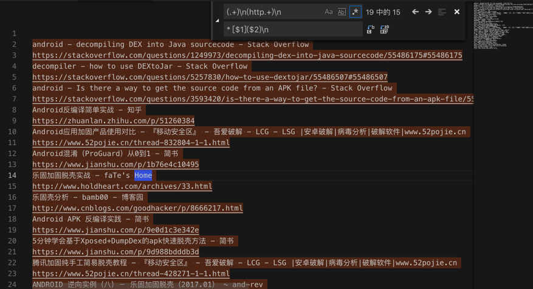
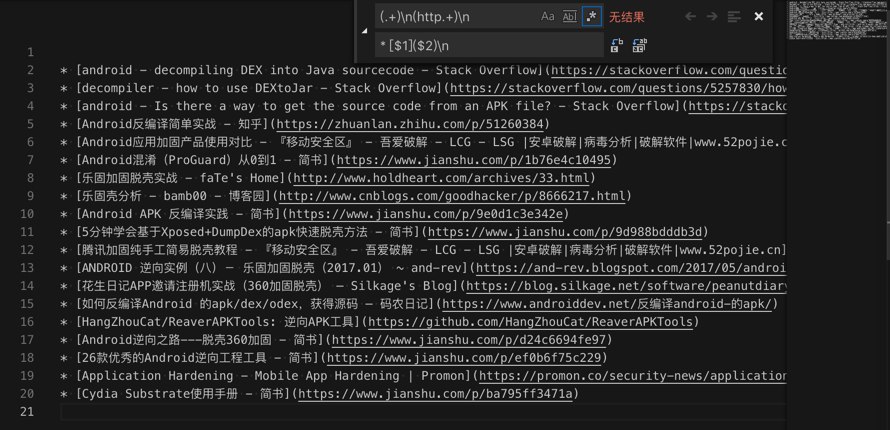

# 文章标题和链接转换为Markdown的链接

正则替换规则：

```bash
(.+)\n(http.+)\n
* [$1]($2)\n
```

从：

```bash
android - decompiling DEX into Java sourcecode - Stack Overflow
https://stackoverflow.com/questions/1249973/decompiling-dex-into-java-sourcecode/55486175#55486175
decompiler - how to use DEXtoJar - Stack Overflow
https://stackoverflow.com/questions/5257830/how-to-use-dextojar/55486507#55486507
android - Is there a way to get the source code from an APK file? - Stack Overflow
https://stackoverflow.com/questions/3593420/is-there-a-way-to-get-the-source-code-from-an-apk-file/55567538#55567538
Android反编译简单实战 - 知乎
https://zhuanlan.zhihu.com/p/51260384
Android应用加固产品使用对比 - 『移动安全区』 - 吾爱破解 - LCG - LSG |安卓破解|病毒分析|破解软件|www.52pojie.cn
https://www.52pojie.cn/thread-832804-1-1.html
Android混淆（ProGuard）从0到1 - 简书
https://www.jianshu.com/p/1b76e4c10495
乐固加固脱壳实战 - faTe's Home
http://www.holdheart.com/archives/33.html
乐固壳分析 - bamb00 - 博客园
http://www.cnblogs.com/goodhacker/p/8666217.html
Android APK 反编译实践 - 简书
https://www.jianshu.com/p/9e0d1c3e342e
5分钟学会基于Xposed+DumpDex的apk快速脱壳方法 - 简书
https://www.jianshu.com/p/9d988bdddb3d
腾讯加固纯手工简易脱壳教程 - 『移动安全区』 - 吾爱破解 - LCG - LSG |安卓破解|病毒分析|破解软件|www.52pojie.cn
https://www.52pojie.cn/thread-428271-1-1.html
ANDROID 逆向实例（八）－ 乐固加固脱壳（2017.01） ~ and-rev
https://and-rev.blogspot.com/2017/05/android-201701.html
花生日记APP邀请注册机实战（360加固脱壳） – Silkage's Blog
https://blog.silkage.net/software/peanutdiary.html
如何反编译Android 的apk/dex/odex，获得源码 – 码农日记
https://www.androiddev.net/反编译android-的apk/
HangZhouCat/ReaverAPKTools: 逆向APK工具
https://github.com/HangZhouCat/ReaverAPKTools
Android逆向之路---脱壳360加固 - 简书
https://www.jianshu.com/p/d24c6694fe97
26款优秀的Android逆向工程工具 - 简书
https://www.jianshu.com/p/ef0b6f75c229
Application Hardening - Mobile App Hardening | Promon
https://promon.co/security-news/application-hardening/
Cydia Substrate使用手册 - 简书
https://www.jianshu.com/p/ba795ff3471a
```

把：



换成：

```markdown
* [android - decompiling DEX into Java sourcecode - Stack Overflow](https://stackoverflow.com/questions/1249973/decompiling-dex-into-java-sourcecode/55486175#55486175)
* [decompiler - how to use DEXtoJar - Stack Overflow](https://stackoverflow.com/questions/5257830/how-to-use-dextojar/55486507#55486507)
* [android - Is there a way to get the source code from an APK file? - Stack Overflow](https://stackoverflow.com/questions/3593420/is-there-a-way-to-get-the-source-code-from-an-apk-file/55567538#55567538)
* [Android反编译简单实战 - 知乎](https://zhuanlan.zhihu.com/p/51260384)
* [Android应用加固产品使用对比 - 『移动安全区』 - 吾爱破解 - LCG - LSG |安卓破解|病毒分析|破解软件|www.52pojie.cn](https://www.52pojie.cn/thread-832804-1-1.html)
* [Android混淆（ProGuard）从0到1 - 简书](https://www.jianshu.com/p/1b76e4c10495)
* [乐固加固脱壳实战 - faTe's Home](http://www.holdheart.com/archives/33.html)
* [乐固壳分析 - bamb00 - 博客园](http://www.cnblogs.com/goodhacker/p/8666217.html)
* [Android APK 反编译实践 - 简书](https://www.jianshu.com/p/9e0d1c3e342e)
* [5分钟学会基于Xposed+DumpDex的apk快速脱壳方法 - 简书](https://www.jianshu.com/p/9d988bdddb3d)
* [腾讯加固纯手工简易脱壳教程 - 『移动安全区』 - 吾爱破解 - LCG - LSG |安卓破解|病毒分析|破解软件|www.52pojie.cn](https://www.52pojie.cn/thread-428271-1-1.html)
* [ANDROID 逆向实例（八）－ 乐固加固脱壳（2017.01） ~ and-rev](https://and-rev.blogspot.com/2017/05/android-201701.html)
* [花生日记APP邀请注册机实战（360加固脱壳） – Silkage's Blog](https://blog.silkage.net/software/peanutdiary.html)
* [如何反编译Android 的apk/dex/odex，获得源码 – 码农日记](https://www.androiddev.net/反编译android-的apk/)
* [HangZhouCat/ReaverAPKTools: 逆向APK工具](https://github.com/HangZhouCat/ReaverAPKTools)
* [Android逆向之路---脱壳360加固 - 简书](https://www.jianshu.com/p/d24c6694fe97)
* [26款优秀的Android逆向工程工具 - 简书](https://www.jianshu.com/p/ef0b6f75c229)
* [Application Hardening - Mobile App Hardening | Promon](https://promon.co/security-news/application-hardening/)
* [Cydia Substrate使用手册 - 简书](https://www.jianshu.com/p/ba795ff3471a)
```



用于：放在`markdown`作为参考资料。
