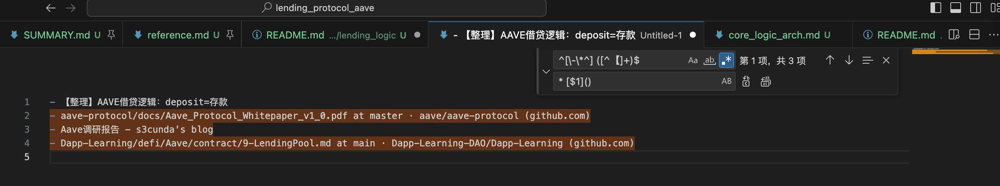
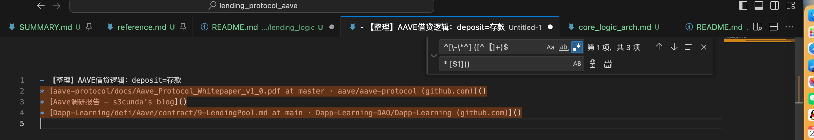

# 给帖子标题加上Markdown的链接的格式

正则语法：

```bash
^[\-\*^] ([^【]+)$

* [$1]()
```

替换前：

```bash
- 【整理】AAVE借贷逻辑：deposit=存款
- aave-protocol/docs/Aave_Protocol_Whitepaper_v1_0.pdf at master · aave/aave-protocol (github.com)
- Aave调研报告 - s3cunda's blog
- Dapp-Learning/defi/Aave/contract/9-LendingPool.md at main · Dapp-Learning-DAO/Dapp-Learning (github.com)
```



替换后：

```bash
- 【整理】AAVE借贷逻辑：deposit=存款
* [aave-protocol/docs/Aave_Protocol_Whitepaper_v1_0.pdf at master · aave/aave-protocol (github.com)]()
* [Aave调研报告 - s3cunda's blog]()
* [Dapp-Learning/defi/Aave/contract/9-LendingPool.md at main · Dapp-Learning-DAO/Dapp-Learning (github.com)]()
```



注：后续再填上url地址，即可成Markdown中的真正的链接了。
