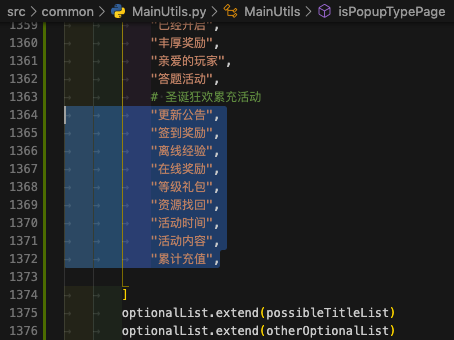

# 把每个词都加上引号，用于放代码中用

用正则：

```bash
(.+)
    "$1",
```

从输入：

```bash
更新公告
签到奖励
离线经验
在线奖励
等级礼包
资源找回
活动时间
活动内容
累计充值

```


变成：

```bash
    "更新公告",
    "签到奖励",
    "离线经验",
    "在线奖励",
    "等级礼包",
    "资源找回",
    "活动时间",
    "活动内容",
    "累计充值",
```


用于拷贝到代码中使用：


